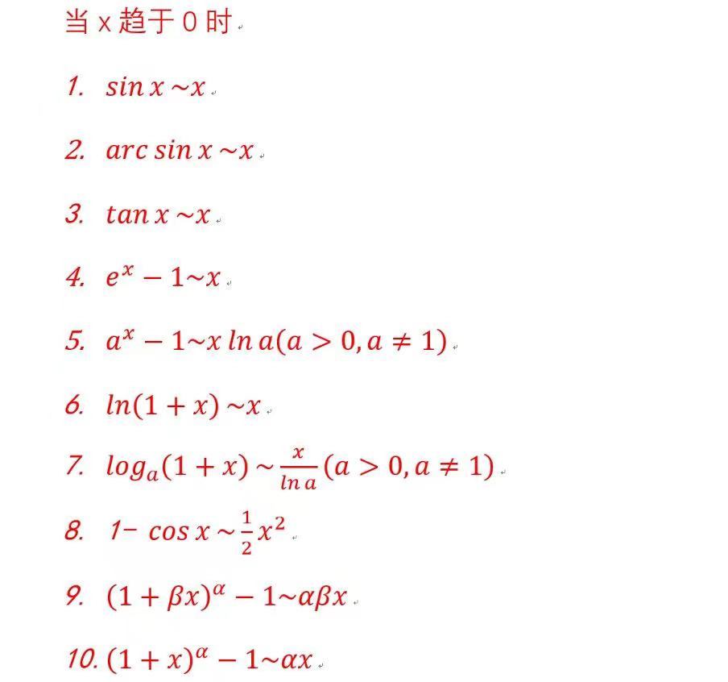
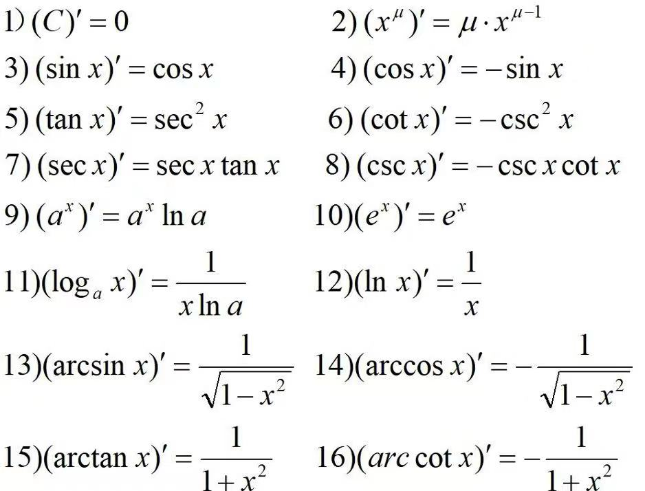

# 引言：

## 1. 高等数学

- sympy

```python
# 导入sympy 中所有内容
from sympy import *
```


1. 求函数极限：


```python
import sympy
from sympy import oo # 注意无穷符号表示形式为两个小写字母
x = sympy.Symbol('x') # 定义 x 为一个符号，表示一个变量。注意 Symbol 第一个字母大写
f = sympy.sin(x)/x
print(sympy.limit(f,x,oo)) # 使用 sympy.limit 函数求极限，并且打印出结果

# ouput
0
```

2. 求函数导数



```python
from sympy import *
from sympy.abc import x, y

# arcsinx 数学函数表示形式为 asin
y = asin(sqrt(sin(x)))

# diff 求导函数
print(diff(y))
```

3. 求偏导数

```python
from sympy import *
from sympy.abc import x,y,z,f
f = x**3 + 3*x*y + y**2
print(diff(f,x))
print(diff(f,y))
fx = diff(f,x)
print(fx.evalf(subs = {x:1,y:2})) # 以字典的形式传入多个变量的值，求函数值
fy = diff(f,y)
print(fy.evalf(subs = {x:1,y:2}))

# output
3*x**2 + 3*y
3*x + 2*y
9.00000000000000
7.00000000000000
```

4. 求方向导数

```python
```

5. 求梯度

```python
```


## 2. 线性代数（linear algebra)

### 2.4 行列式

1. 方阵的行列式（np.linalg.det()）

```python
```

## 2.5 矩阵

1. 


3. 检验矩阵是否相等（np.allclose()）

```python

```

4. 获取矩阵的秩（np.linalg.matrix_rank()）

```python
```

5. 逆矩阵（np.linalg.inv()）

```python
```


6. 增广矩阵（np.hastck()）

### 2.6 内积与正交

1. 内积运算（np.dot()）

```python
```

2. 获取向量的长度（np.linalg.norm()）

```python
```

3. 对原浮点数进行四舍五入

```python

```


