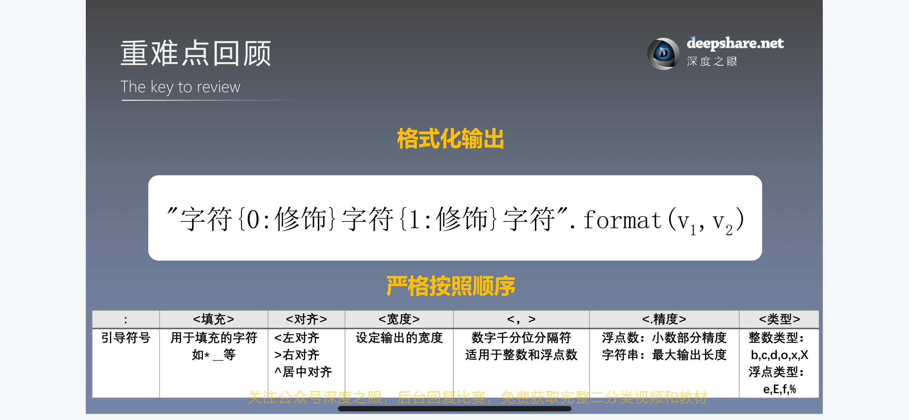
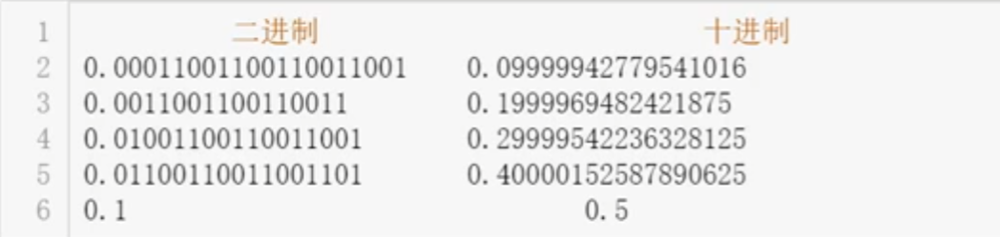

# basic knowledge extension for Python

**引言： 这篇文章旨在为 Ryan 本人服务**

##  1. 基本语法元素

### 1.1 格式化输出




1. **填充输出**

```python
# 右对齐
a = 123
print('{0:_>4}'.format(a)) # _123
b = 1111
print('{0:&>10}'.format(b)) # &&&&&&1111
# 左对齐
a = 'a'
print('{0:*<5}'.format(a)) # a****
# 居中
a = 'middle'
print('{0:#^16}'.format(a)) # #####middle#####
print('{0:#^15}'.format(a)) # ####middle#####
print('{0:#^17}'.format(a)) # #####middle######
```

2. **数字千分位分隔符**

```python
# 显示1,000,000
a = 1000000
print("{0:,}".format(a)) # 1,000,000

# 填充优先级高于千分位
a = 1000000
print("{0:*>20,}".format(a)) # ***********1,000,000
```

3. **浮点数简化输出**

- 留两位小数

```python
a = 3.1415926
print("{0:.2f}".format(a)) # 3.14
```

- 按百分数输出

```python
a = 3.1415926
print("{0:%}".format(a)) # 314.159260%


a = 3.1415926
print("{0:.1%}".format(a)) # 314.2%
```

- 科学计数法输出

```python
a = 0.1415926
print("{0:e}".format(a)) # 1.415926e-01


a = 0.0000926
print("{0:.2e}".format(a)) # 9.26e-05
```

4. **整数的进制转换输出**

- 十进制整数转二进制、unicode码、十进制、八进制、十六进制输出

```python
print('二进制{0:b}, Unicode码{0:c}, 十进制{0:d}, 八进制{0:o}, 十六进制{0:x}'.format(450))

# output: 二进制111000010, Unicode码ǂ, 十进制450, 八进制702, 十六进制1c2 
```


### 1.2 程序格式

#### 1. 最大行长度

所有行限制的最大字符数为 79

#### 2. 缩进

- 用缩进来表示语句间的逻辑
- 在 for while if def class等:之后下一行开始进行缩进，表明后续代码与前句之间的从属关系
- 缩进量:4字符

#### 3.使用空格

- 二元运算符两边加一个加空格

```python
x = 2
x += 4
6 > 2
```

- 使用不同优先级的运算符，考虑在最低优先级的运算符周围添加空格

```python
x = x*2 - 1
z = x*2 + y*y
c = (a+b) * (a-b)
```

- 在逗号后使用空格

```python
x, y = 1, 2
ls = [1, 2, 3]
```

- 不要使用一个以上的空格

```python
x =             2
```

#### 4. 避免使用空格

- 在指定关键字参数或者默认参数值的时候，不要在 = 附近加上空格

```python
def fun(n=1, m=2):
    pritn(n, m)
```

####  小结：

1. **以上属于PEP8格式指南的部分内容，养成良好的编码规范利人利己**
2. **格式约定的目的:**
    1. 使大量Python代码风格一致
    2. 提升代码可读性
3. **尽信书不如无书，不应死板教条的执行格式规范**
    1. 项目规范优先

## 2. 基本数据类型

### 2.1 数字型

#### 2.1.1. 整数————不同进制的转换

默认输入：十进制

二进制：`0b`

八进制：`0o`

十六进制：`0x`

```python
16 == 0b10000 == 0o20 == 0x10
```

- 十进制与其他进制的转换

```python
a = bin(16) # 2
b = oct(16) # 8
c = hex(16) # 16
print(a, b, c)

# output
0b10000 0o20 0x10
```

::: warning 

转换后的结果会变为字符串（str）类型

```python
print(type(a), type(b), type(c))

# output
<class 'str'> <class 'str'> <class 'str'>
```

:::

- 其他进制转换为十进制

```python
a = bin(16)
b = oct(16)
c = hex(16)

d = int(a, 2) # 二进制转十进制
e = int(b, 8) # 八进制转十进制
f = int(c, 16) # 十六进制转十进制
print(d, e, f) 

# output
16 16 16
```

#### 2.1.2. 浮点数

- * * 不确定小数问题**

```
print((0.1 + 0.2) == 0.3) # False
print(0.1 + 0.2) # 0.30000000000000004
```

- **产生该问题的原因：**

浮点数小数部分在计算机是由二进制表示的，二进制小数不能表示所有的十进制小数




 

- **通常情况下不会影响精度**

```python
print(0.1 + 0.7) # 0.7999999999999999
```


- **如何求得真正想表达的十进制：————四舍五入(`.round()`)**

```python
a = 3 * 0.1
b = round(a, 1)
print(a) # 0.30000000000000004
print(b) # 0.3
print(b == 0.3) # True
```

#### 2.1.3. *虚数

- 格式：`a + bj` 或 `a + bJ`

```python
a = 3 + 4j
b = 2 + 5J
print(a, b)

# output
(3+4j) (2+5j)
```

::: warning

若虚部数值为 1， 也要写成 1j

```python
a = 1 + j
print(a)

# output
Traceback (most recent call last):
  File "C:\Users\Administrator\PycharmProjects\Coder\Python\basic_knowledge_extension\Data_type\imaginary_number.py", line 8, in <module>
    a = 1 + j
NameError: name 'j' is not defined
```

:::

#### 2.1.4. 数字型的函数

- 绝对值 abs()

```python
print(abs(-1)) # 1
print(abs(3+4j))  # 对复数a+bj 执行的是求模运算(a^2+b^2)^0.5
```

- 幂次方 pow()

```python
print(pow(2, 5)) # 32
print(pow(2, 5, 3)) # 等价于 (2^5) % 3 = 2
```

- 四舍五入 round

```python
a = 1.618
print(round(a)) # 默认状态下四舍五入保留零位小数

print(round(a, 2)) # 保留两位小数

print(round(a, 10)) # 位数不足时， 无需不起！！！！！！

# output
2
1.62
1.618
```

- 整除返回商和模 divmod()

```python
a, b = divmod(11,3)
print(a) # 整除数
print(b) # 余数

# output
3
2
```

- 最大/小值 max()/min()

```python
In [1]: max(1,2,3)
Out[1]: 3

In [2]: max([1,2,3])
Out[2]: 3

In [3]: max((1,2,3))
Out[3]: 3

In [4]: max({1,2,3})
Out[4]: 3

In [5]: max({1:3, 2:2, 3:1})
Out[5]: 3

In [6]: max({1:333, 2:222, 3:111})
Out[6]: 3

In [7]: max(a, b, c)
---------------------------------------------------------------------------
NameError                                 Traceback (most recent call last)
Cell In[7], line 1
----> 1 max(a, b, c)

NameError: name 'a' is not defined

In [8]: max(A,a)
---------------------------------------------------------------------------
NameError                                 Traceback (most recent call last)
Cell In[8], line 1
----> 1 max(A,a)

NameError: name 'A' is not defined
```

- 求和 sum()

```python
```

- 科学计算库 math、numpy、scipy

```python
import math # 导入库
print(math.exp(1)) # 指数运算
print(math.log2(2)) # 对数运算
print(math.sqrt(4)) # 开平方运算

# output
2.718281828459045
1.0
2.0

import numpy as np
a = [1,2,3,4,5]
print(np.mean(a)) # 求平均值
print(np.median(a)) # 求中位数
print(np.std(a)) # 求标准差

# output
3.0
3.0
1.4142135623730951
```

### 2.2  字符串

#### 2.2.1 字符串的成倍复制

Str * n 或 n * Str 

```python
a = '----21'
b = 'can you do something for me----'
c = a + b
print(c * 3)
print('\n')
print(3 * c)

# output
----21can you do something for me--------21can you do something for me--------21can you do something for me----


----21can you do something for me--------21can you do something for me--------21can you do something for me----
```

#### 2.2.2 判断子集是否在字符串内 in

```python
Str = 'hello, my name is ryan.'
str1 = 'hello'
str2 = 'Hello'
print(str1 in Str) # True
print(str2 in Str) # False
```

#### 2.2.3 字符编码

将中文字库，英文字母、数字、特殊字符等转化成计算机可识别的二进制数

::: tips

1. Python 中使用的是 Unicode 编码
2. 每个单一字符对应一个唯一的互不重复的二进制编码

:::

1. 将字符转化为 Unicode 码 ord()

```python
print(ord('1'))
print(ord('2'))
print(ord('a'))
print(ord('你'))
print(ord('坏'))

# output
49
50
97
20320
22351
```

2. 将 Unicode 码转化为字符 chr()

```python
print(chr(1010))
print(chr(10000))
print(chr(12345))
print(chr(23456))

# output
ϲ
✐
〹
宠
```

### 2.3 布尔型

#### 2.3.1 判断是否全为真/假 `any()` 和 `all()`


## 3. 组合数据类型

### 3.1 列表

#### range()

range(起始数字,结束数字（不包含）,步长)

1. 必须包含终止位置
2. 默认起始数字是 0 
3. 默认步长是 1

- range() 就这两种写法：

```python
for i in range(5):
    print(i)

# output
0
1
2
3
4

for i in range(1, 5, 1):
    print(i)

# output
1
2
3
4
```

- range() 转其他数据类型

```python
lst1 = list(range(1, 6, 1))
lst2 = tuple(range(1, 6, 1))
lst3 = set(range(1, 6, 1))
lst4 = str(range(1, 6, 1)) # 不可以


print(lst1, lst2, lst3, lst4, sep = '\n')

# output
[1, 2, 3, 4, 5]
(1, 2, 3, 4, 5)
{1, 2, 3, 4, 5}
range(1, 6)
```

### 3.2  元组

1. zip


2. 返回值不止一个的函数，默认返回一个元组

```python
def f(x):
    return pow(x,2), pow(x,3), pow(x,4)
a = f(2)
print(a)

# output
(4, 8, 16)
```

```python
def f(x):
    return pow(x,2), pow(x,3), pow(x,4)
a, b = f(2)
print(a, b)

# output
Traceback (most recent call last):
  File "C:\Users\Administrator\PycharmProjects\Coder\Python\basic_knowledge_extension\Combination_type\List.py", line 45, in <module>
    a, b = f(2)
ValueError: too many values to unpack (expected 2)
```

```python
def f(x):
    return pow(x,2), pow(x,3), pow(x,4)
a, b, c = f(2)
print(a, b, c)

# output
4 8 16
```

#### 3.3 字典

一些常用于列表（list）中的操作的括号中的元素位置一般在字典中用字典键取代，如：

```python
dict1 = {11:'a', 22:'b', 33:'c'}
print(dict1[11]) # a

dict1[44] = 'd'
print(dict1) # {11: 'a', 22: 'b', 33: 'c', 44: 'd'}

del dict1[44]
print(dict1) # {11: 'a', 22: 'b', 33: 'c'}

dict1.pop(33)
print(dict1) # {11: 'a', 22: 'b'}
```

特殊的：

1. `key(), value(), items()`

不加 `list() `默认状态下，返回的东西很奇怪！

```python
dict1 = {11:'a', 22:'b', 33:'c'}
key = dict1.keys()
value = dict1.values()
item = dict1.items()

print(key, value, item, sep = '\n')
# output
dict_keys([11, 22, 33])
dict_values(['a', 'b', 'c'])
dict_items([(11, 'a'), (22, 'b'), (33, 'c')])


keys = list(dict1.keys())
values = list(dict1.keys())
items = list(dict1.items())

print(keys, values, items, sep = '\n')
# output
[11, 22, 33]
[11, 22, 33]
[(11, 'a'), (22, 'b'), (33, 'c')]
```

2. `in()` 

即可以判断 key 也可以判断 value———— dict 不加 .value() 或 .key() 默认判断 key 值

```python
dict1 = {11:'a', 22:'b', 33:'c'}
print(11 in dict1) # True
print(11 in dict1.keys()) # True
print(11 in dict1.values()) # False
print('a' in dict1.values()) # True
```

3. `popitem()`

随机删除字典中的一对键与键值，一个返回变量返回元组，两个分别返回键和键值

```python
dict1 = {11:'a', 22:'b', 33:'c', 44:'d'}
key_and_value = dict1.popitem()

print(key_and_value) 
print(dict1) 

key, value = dict1.popitem()
print(key, value, sep = '\n')

# output
(44, 'd')
{11: 'a', 22: 'b', 33: 'c'}
33
c
```

4. `get()`

value = get()

用于输入一个 key，返回其在字典内的 value，没有该 key 则返回默认值 none 或 设置的值

```python
dict1 = {11:'a', 22:'b', 33:'c'}
print(11) # a

print(12) # None

print(get(11, 'wtf')) # a

print(get(12, 'wtf')) # wtf

value1 = dict1.get(11)
print(value1) # a

value2 = dict1.get(11, 'wtf')
print(value2) # a

value3 = dict1.get(12)
print(value3) # None

value4 = dict1.get(12,'wtf')
print(value4) # wtf
```

5. clear()

```python
dict1 = {11:'a', 22:'b', 33:'c', 44:'d'}
dict1.clear()
print(dict1) # {}
```

::: warning

del 和 clear 的区别在于：

del dict 直接把字典 dict 删除 ，运行结果会报错

而 clear 是清空字典

```python
dict1 = {11:'a', 22:'b', 33:'c', 44:'d'}
dict1.clear()
print(dict1) 
# output
{}


dict1 = {11:'a', 22:'b', 33:'c', 44:'d'}
del dict1
print(dict1)
# output
Traceback (most recent call last):
  File "C:\Users\Administrator\PycharmProjects\Coder\Python\basic_knowledge_extension\Data_type\dict.py", line 70, in <module>
    print(dict1)
NameError: name 'dict1' is not defined
```

:::

- 字典的嵌套使用：

1. 列表嵌套字典

2. 字典嵌套字典

```python
class1 = {'tom':{'grade':1, 'age':7}, 'mike':{'grade':1,'age':8}}
print(class1['tom']['age'])
print(class1['mike']['grade'])

# output
7
1
```

### 3.4 集合

集合里元素的 “位置” 不固定，每次打印集合元素的前后顺序都是随机的

#### 3.4.1 数学运算

数学运算的结果都是返回一个新的集合

1. 交集 &
2.  并集 |
3. 两集合的非交集部分 ^
4. 补集（在前者但不在后者）-

#### 3.4.2 操作

- 增删元素 add(), remove()

```python
starts = {'a', 'b', 'c'}
starts.add('d')
print(starts)
starts.remove('d')
print(starts)

# output
{'a', 'b', 'd', 'c'}
{'a', 'b', 'c'}
```

## 4. 程序控制结构

#### 4.1 条件测试

#### 4.1.1 非空 

数据结构不为空，变量不为 0、none、False 则条件成立

```python
a = [1]
if a:
    print('非空')
else:
    print('空的')
```

#### 4.1.2 逻辑运算

- 与、或、非
- and
- or
- not

```python
a = 10
b = 8
c = 12
print((a>b) and (b>c)) # 与
print((a>b) or (b>c)) # 或
print(not(a>b)) # 非   

# output
False
True
False
```

- 优先级：`not>and>or`

```python
print(True or True and False)
print((True or True) and False)

# output
True
False
```

#### 4.1.3 存在运算 

- in

```python
cars = ['byd', 'bmw', 'audi', 'toyota']
print('bmw' in cars)
print('bens' in cars)

# output
True
False
```

- not in

```python
cars = ['byd', 'bmw', 'audi', 'toyota']
print('bmw' not in cars)
print('bens' not in cars)

# output
False
True
```

### 4.2 遍历循环

#### 4.2.1 变换迭代————字典

```python
students = {201901: '小明', 201902: '小红', 201903:'小强'}
for k, v in students.items(): # key & value
    print(k, v)
for v in students.values(): # value
    print(v)
for k in students.keys(): # keys
    print(k)
    
# output
201901 小明
201902 小红
201903 小强
小明
小红
小强
201901
201902
201903
```

#### 4.2.2 range() 对象

- range(起始:结束(该数字不包括):步长)

```python
res = []
for i in range(10000):
    res.append(i ** 2)
print(res[:5]) # [0, 1, 4, 9, 16]
```

- range() 也是左闭右开！

```
res = []
for i in range(1,10,2):
    res.append(i ** 2)
print(res) # [1, 9, 25, 49, 81]
```

#### 4.2.3 for 和 else 配合:


```python
product_scores = [89, 90, 99, 70, 67, 78, 85, 92, 77, 82]
"""
一组十个的产品，其性能评分如果低于七十五分的超过一个，则该组产品不合格
"""
i = 0
for score in product_scores:
    if score < 75:
        i += 1
    if i == 2:
        print('产品不合格')
        break
else:
    print('产品抽检合格')

```

### 4.2.4 while 和 else 融合：

```python
count = 0
while count <= 4:
    count += 1
    print(count)
else:
    print("循环正常执行啦")
    
    
# output
1
2
3
4
5
循环正常执行啦
```

### 4.3 控制语句注意问题

-  减少多层嵌套

- 避免死循环

-  封装过于复杂的判断条件

如果条件判断里的表达式过于复杂，出现多次的 not/and/or 等

会导致可读性大打折扣———— **考虑将条件封装为函数**

```python
a, b, c, d, e = 10, 8, 6, 2, 0
if (a > b) and (c > d) and (not e)
    print("太复杂了！")

numbers = (10, 8, 6, 2, 0)
```

```python
def judge(num):
    a, b, c, d, e = num
    x = a > b
    y = c > d
    z = not e
    return x and y and z

if judge(numbers):
    print('nice!')

# nice!
```

## 5. 函数

### 5.1 关键字参数与位置参数

关键字参数

- 严格按照位置顺序，用实参对形参进行赋值（关联）

```python
def function(x,y,z):
    print(x, y, z)
function(1, 2, 3)
```

位置参数

- 打破位置限制，直呼其名的进行值的传递

```python
function(y=1, z=2,x=3)
```

两者可以混用，但是关键字参数必须放在位置参数后面

```python
function(1, z=2, y=3)
function(1, 2, z=3)
```


### 5.2 默认参数

- 提前在函数里设定好的值————必须放在非默认参数后面！！！

```python
def register(name, age, sex='male'): # sex 有默认值，一定要放最后
    print(name, age, sex)

register('ryan', 19)
# output
ryan 19 male
```

- 或者可以直接传值————直接修改默认值

```python
def register(name, age, sex='male'):
    print(name, age, sex)

register('ryan', 19)
register('winter',22, 'female')
# output

ryan 19 male
winter 22 female
```

默认参数应该设置为不可变的类型（数字、字符串、元组）

- 默认参数应该设置为不可变的类型

否则：

```python
def function(ls=[]):
    print(id(ls))
    ls.append(1)
    print(id(ls))
    print(ls)

function()
function()
function()

# output
1903176266176
1903176266176
[1]
1903176266176
1903176266176
[1, 1]
1903176266176
1903176266176
[1, 1, 1]
```

所以应该：

```python
def function(ls='Python'):
    print(id(ls))
    ls += '3.7'
    print(id(ls))
    print(ls)
    
function()
function()
function()

# output
2334782625648
2334787222576
Python3.7
2334782625648
2334787222512
Python3.7
2334782625648
2334787222576
Python3.7
```

- 利用默认参数决定参数是否加入函数中

```python
def name(first_name, last_name, middle_name=None): # middle_name 默认是没有的，只有用户输入 middle_name 才会有
    if middle_name:
        return first_name + middle_name + last_name
    else:
        return first_name + last_name

print('l','j')
print('l','x','j')

# output
l j
l x j
```

### 5.3 可变参数

1.  *args 

必须放在参数最后

```python
def function(x, y, z,  *args):
    print(x, y, z)
    print(args)

function(1, 2, 3, 4, 5, 6)

# output
1 2 3
(4, 5, 6)
```

2. 实参拆分

```python
def function(x, y, z,  *args):
    print(x, y, z)
    print(args)

function(1, 2, 3, [1,2,3])

# output
1 2 3
([1, 2, 3],)

def function(x, y, z,  *args):
    print(x, y, z)
    print(args)

function(1, 2, 3, 'hello')

# output
1 2 3
('hello',)
```

给列表、字符串、元组、集合拆分

```python
def function(x, y, z,  *args):
    print(x, y, z)
    print(args)

function(1, 2, 3, *[4, 5, 6])

# output
1 2 3
(4, 5, 6)

def function(x, y, z,  *args):
    print(x, y, z)
    print(args)

function(1, 2, 3, *'hello')

# output
1 2 3
('h', 'e', 'l', 'l', 'o')
```

2.  可变长参数 **kwargs

```python
def function(x, y, z, **kwargs):
    print(x, y, z)
    print(kwargs)

function(1, 2, 3, a= 1, b = 2, c = 3 )

# output
1 2 3
{'a': 1, 'b': 2, 'c': 3} # 多余参数以字典形式打包传递给 kwargs 
```

字典实参拆分

```python
def function(x, y, z, **kwargs):
    print(x, y, z)
    print(kwargs)

function(1, 2, 3, **{'a':1, 'b':2, 'c':3})

# output
1 2 3
{'a': 1, 'b': 2, 'c': 3}
```

### 5.4 全局变量

- 在函数外定义的变量
- 全局变量在函数体内直接被使用

```python
n = 3
ls = [0]
def multipy(x, y):
    z = n*x*y
    ls.append(z)
    return z

print(multipy(2, 9))
print(ls)

# output
54
[0, 54]
```

#### 5.4.1 通过 global 在函数体内定义全局变量

```python
# 没有设置全局变量
def multipy0(x, y): 
    z = x*y 
    return z
print(multipy0(2, 9))
print(z)

# output
Traceback (most recent call last):
  File "C:\Users\Administrator\PycharmProjects\Coder\Python\basic_knowledge_extension\function\function.py", line 126, in <module>
    print(z)
NameError: name 'z' is not defined


# 设置为全局变量
def multipy1(x, y):
    global z
    z = x*y
    return z

print(multipy1(2, 9))
print(z)

# output
18
18
```

### 5.5 返回值

1. 单个返回值

```python
def function(x):
    return x**2

print(function(2))

# output
4
```

2. 多个返回值

- 以元组形式返回

```python
def function(x):
    return x, x**2, x**3

print(function(2))

# output
(2, 4, 8)
```

- 拆分赋值

```python
def function(x):
    return x, x**2, x**3

a, b, c = function(2)
print(a, b, c)
# output
2 4 8
```

3. 没有 return 语句， 返回值为 None

```python
def function():
    print('hello')

a = function()
print(a)

# output
hello
None
```

### 5.6 匿名函数

基本形式：

lambda 变量: 函数体

1. 

```python
f = lambda: 'Hello world'
print(f())

# output
Hello world
```

2. 

```python
x = lambda a: a+10
print(x(1))

# output
11
```

3. 

```python
x = lambda a, b, c: a + b + c
print(x(1, 2, 3))

# output
6
```

4. 

```python
numbers = [1, 2, 3, 4, 5, 6]
squared = list(map(lambda x: x**2, numbers))
print(squared)

# output
[1, 4, 9, 16, 25, 36]
```

扩展使用方法:

1.  sort, sorted

```python
ls = [(7,2),(5,4),(3,6),(1,8)]
ls.sort()
print(ls)

ls.sort(key = lambda x: x[1] )
print(ls)

ls_sorted = sorted(ls, key = lambda x: x[0] + x[1], reverse = True)
print(ls_sorted)

# output
[(1, 8), (3, 6), (5, 4), (7, 2)]
[(7, 2), (5, 4), (3, 6), (1, 8)]
[(7, 2), (5, 4), (3, 6), (1, 8)]
```

2. max, min

```python
ls = [(7,2),(5,4),(3,6),(1,8)]
n = max(ls, key = lambda x: x[1])
m = min(ls, key = lambda x: x[0] + x[1])

print(m, n)

# output
(7, 2) (1, 8)
```

## 6. 类

### 6.1 类的定义

三要素：类名、属性、方法

#### 6.1.1 类的命名

- 要有实际意义
- 驼峰命名法，如 CreditCard

```python
"""类前空两行"""

class car():
    """对该类进行简单介绍"""
    pass

"""类后空两行"""
```

#### 6.1.2 类的属性

```python
# def __init__(self,要传递的参数) 初始化类的属性
```

```python


class car():
    """模拟汽车"""

    def __init__(self, brand, model, year):
        """初始化汽车属性"""
        self.brand = brand # 汽车的品牌
        self.model = model # 汽车的属性
        self.year = year # 汽车出厂年份
        self.mileage = 0 # 新车总里程初始化为 0     
```

#### 6.1.3 类的方法

可以理解为类内部函数

```python


class car():
    """模拟汽车"""

    def __init__(self, brand, model, year):
        """初始化汽车属性"""
        self.brand = brand # 汽车的品牌
        self.model = model # 汽车的属性
        self.year = year # 汽车出厂年份
        self.mileage = 0 # 新车总里程初始化为 0
    def get_main_information(self):
        """获取汽车主要信息"""
        print("品牌:{} 型号:{} 出厂年份:{}".format(self.brand, self.model, self.year))

    def get_mileage(self):
        """获取总里程"""
        return "行车总里程: {}公里".format(self.mileage)
        
        
```

### 6.2 创建实例

#### 6.2.1 实例的创建

将实例赋值给对象、实例化过程中，传入相应的参数

v = 类名（必要的初始化参数）

```python
 my_new_car = car('audi', 'a6', 2018)
```

#### 6.2.2 访问属性

实例名.属性名

```python
print(my_new_car.brand)
print(my_new_car.model)
print(my_new_car.year)

# output
audi
a6
2018
```

#### 6.2.3 调用方法

```python
class car():
    """模拟汽车"""

    def __init__(self, brand, model, year):
        """初始化汽车属性"""
        self.brand = brand  # 汽车的品牌
        self.model = model  # 汽车的属性
        self.year = year  # 汽车出厂年份
        self.mileage = 0  # 新车总里程初始化为 0

    def get_main_information(self):
        """获取汽车主要信息"""
        print("品牌:{} 型号:{} 出厂年份:{}".format(self.brand, self.model, self.year))

    def get_mileage(self):
        """获取总里程"""
        return "行车总里程: {}公里".format(self.mileage)
```

品牌:audi 型号:a6 出厂年份:2018

```python
mileage = my_new_car.get_mileage()
print(mileage)
```

行车总里程: 0公里

#### 6.2.4 修改属性

1. 直接修改

```python
class car():
    """模拟汽车"""

    def __init__(self, brand, model, year):
        """初始化汽车属性"""
        self.brand = brand  # 汽车的品牌
        self.model = model  # 汽车的属性
        self.year = year  # 汽车出厂年份
        self.mileage = 0  # 新车总里程初始化为 0

    def get_main_information(self):
        """获取汽车主要信息"""
        print("品牌:{} 型号:{} 出厂年份:{}".format(self.brand, self.model, self.year))

    def get_mileage(self):
        """获取总里程"""
        return "行车总里程: {}公里".format(self.mileage)

# 先访问
my_old_car = car('byd', '陆', 2016)

# 后修改
print(my_old_car.mileage) # 0
my_old_car.mileage = 99999

# 查看修改效果
print(my_old_car.mileage) # 99999
print(my_old_car.get_mileage()) # 行车总里程: 99999公里
```

2. 创建一个新的方法修改

```python
class car():
    """模拟汽车"""

    def __init__(self, brand, model, year):
        """初始化汽车属性"""
        self.brand = brand  # 汽车的品牌
        self.model = model  # 汽车的属性
        self.year = year  # 汽车出厂年份
        self.mileage = 0  # 新车总里程初始化为 0

    def get_main_information(self):
        """获取汽车主要信息"""
        print("品牌:{} 型号:{} 出厂年份:{}".format(self.brand, self.model, self.year))

    def get_mileage(self):
        """获取总里程"""
        return "行车总里程: {}公里".format(self.mileage)
    
    
```

```python
my_old_car = car('byd', '陆', 2016)
print(my_old_car.get_mileage()) # 行车总里程: 0公里
my_old_car.set_mileage(8000)
print(my_old_car.get_mileage()) # 行车总里程: 8000公里
```

3. 继续拓展

- 禁止设置负里程

```python
class car():
    """模拟汽车"""

    def __init__(self, brand, model, year):
        """初始化汽车属性"""
        self.brand = brand  # 汽车的品牌
        self.model = model  # 汽车的属性
        self.year = year  # 汽车出厂年份
        self.mileage = 0  # 新车总里程初始化为 0

    def get_main_information(self):
        """获取汽车主要信息"""
        print("品牌:{} 型号:{} 出厂年份:{}".format(self.brand, self.model, self.year))

    def get_mileage(self):
        """获取总里程"""
        return "行车总里程: {}公里".format(self.mileage)

    def set_mileage(self, distance):
        """设置总里程数"""
        if distance >= 0:
            self.mileage = distance
        else:
            print("里程数不可设置为负")
```

```python
my_old_car = car('byd', '陆', 2016)

my_old_car.set_mileage(-8000)
print(my_old_car.get_mileage()) 

# output
里程数不可设置为负
行车总里程: 0公里
```

- 将每次的里程数增加

```python
class car():
    """模拟汽车"""

    def __init__(self, brand, model, year):
        """初始化汽车属性"""
        self.brand = brand  # 汽车的品牌
        self.model = model  # 汽车的属性
        self.year = year  # 汽车出厂年份
        self.mileage = 0  # 新车总里程初始化为 0

    def get_main_information(self):
        """获取汽车主要信息"""
        print("品牌:{} 型号:{} 出厂年份:{}".format(self.brand, self.model, self.year))

    def get_mileage(self):
        """获取总里程"""
        return "行车总里程: {}公里".format(self.mileage)

    def set_mileage(self, distance):
        """设置总里程数"""
        if distance >= 0:
            self.mileage = distance
        else:
            print("里程数不可设置为负")

    def increment_mileage(self, distance):
        """总里程数累计"""
        if distance >= 0:
            self.mileage += distance
        else:
            print("新增里程数不能为负")
```

```python
my_old_car = car('byd', '陆', 2016)

print(my_old_car.get_mileage())
my_old_car.set_mileage(9999)
my_old_car.increment_mileage(90000)
print(my_old_car.get_mileage())

# output
行车总里程: 0公里
行车总里程: 99999公里
```

### 6.3 类的继承

#### 6.3.1 简单的继承

**父类**

```python
class car():
    """模拟汽车"""

    def __init__(self, brand, model, year):
        """初始化汽车属性"""
        self.brand = brand  # 汽车的品牌
        self.model = model  # 汽车的属性
        self.year = year  # 汽车出厂年份
        self.mileage = 0  # 新车总里程初始化为 0

    def get_main_information(self):
        """获取汽车主要信息"""
        print("品牌:{} 型号:{} 出厂年份:{}".format(self.brand, self.model, self.year))

    def get_mileage(self):
        """获取总里程"""
        return "行车总里程: {}公里".format(self.mileage)

    def set_mileage(self, distance):
        """设置总里程数"""
        if distance >= 0:
            self.mileage = distance
        else:
            print("里程数不可设置为负")

    def increment_mileage(self, distance):
        """总里程数累计"""
        if distance >= 0:
            self.mileage += distance
        else:
            print("新增里程数不能为负")

my_old_car = car('byd', '陆', 2016)


my_old_car.set_mileage(9999)
my_old_car.increment_mileage(90000)


my_new_car = car('audi', 'A6', 2018)

my_cars = [my_new_car, my_old_car]
print(my_cars)
# output
[<__main__.car object at 0x000001EB5585CF10>, <__main__.car object at 0x000001EB5585CFD0>]
```

**子类**

class 子类名（父类名）：

```python
class car():
    """模拟汽车"""

    def __init__(self, brand, model, year):
        """初始化汽车属性"""
        self.brand = brand  # 汽车的品牌
        self.model = model  # 汽车的属性
        self.year = year  # 汽车出厂年份
        self.mileage = 0  # 新车总里程初始化为 0

    def get_main_information(self):
        """获取汽车主要信息"""
        print("品牌:{} 型号:{} 出厂年份:{}".format(self.brand, self.model, self.year))

    def get_mileage(self):
        """获取总里程"""
        return "行车总里程: {}公里".format(self.mileage)

    def set_mileage(self, distance):
        """设置总里程数"""
        if distance >= 0:
            self.mileage = distance
        else:
            print("里程数不可设置为负")

    def increment_mileage(self, distance):
        """总里程数累计"""
        if distance >= 0:
            self.mileage += distance
        else:
            print("新增里程数不能为负")
```


- 创建子类：

```python
class Elecriccar(car):
    """模拟电动汽车"""
    def __init__(self, brand, model, year):
    """初始化电动汽车属性"""
    super().__init__(brnad, model, year) # 声明继承父类的属性
```

-  已经包含父类的所有方法：

```python
my_electric_car = Elecriccar('Nextweek', 'FF91', 2046)
my_electric_car.get_main_information()
```

品牌:Nextweek 型号:FF91 出厂年份:2046

#### 6.3.2 给子类添加属性和方法

```python
class Elecriccar(car):
    """模拟电动汽车"""
    def __init__(self, brand, model, year, bettery_size):
        """初始化电动汽车属性"""
        super().__init__(brand, model, year) # 声明继承父类的属性
        self.bettery_size = bettery_size # 电池容量
        self.electric_quantity = bettery_size # 电池剩余数量
        self.electric_distance_ratio = 5 # 电量距离换算系数 5 公里/kw.h
        self.remainder_range = self.electric_quantity*self.electric_distance_ratio # 剩余可行驶里程

    def get_electric_quantity(self):
        """查看当前电池电量"""
        print("当前电池的电量: {} Kw.h".format(self.electric_quantity))

    def set_electric_quantity(self, electric_quantity):
        """设置电池剩余电量，重新计算电量可支撑行驶里程"""
        if electric_quantity >= 0 and electric_quantity <= self.bettery_size:
            self.electric_quantity = electric_quantity
            self.remainder_range = self.electric_quantity*self.electric_distance_ratio
        else:
            print("电量未设置在合理范围之内")
    def get_remainder_range(self):
        """查看剩余可行驶里程"""
        print("当前电量还可以继续行驶 {} 公里".format(self.remainder_range))
```

```python
my_electric_car = Elecriccar('nextweek', 'FF91', 2046, 70)
my_electric_car.get_electric_quantity() # 获取当前电池电量
my_electric_car.get_remainder_range() # 获取当前剩余可行使里程
```

当前电池的电量: 70 Kw.h
当前电量还可以继续行驶 350 公里

```python
my_electric_car.set_electric_quantity(50) # 重设电池电量
my_electric_car.get_electric_quantity() # 获取当前电池电量
my_electric_car.get_remainder_range() # 获取当前剩余可行驶里程
```

当前电池的电量: 50 Kw.h
当前电量还可以继续行驶 250 公里

#### 6.3.3 重写父类的方法————多态

原先：

```python
my_electric_car.get_main_information(
```

品牌:nextweek 型号:FF91 出厂年份:2046


修改后：

```python
class Elecriccar(car):
    """模拟电动汽车"""
    def __init__(self, brand, model, year, bettery_size):
        """初始化电动汽车属性"""
        super().__init__(brand, model, year) # 声明继承父类的属性
        self.bettery_size = bettery_size # 电池容量
        self.electric_quantity = bettery_size # 电池剩余数量
        self.electric_distance_ratio = 5 # 电量距离换算系数 5 公里/kw.h
        self.remainder_range = self.electric_quantity*self.electric_distance_ratio # 剩余可行驶里程

    def get_main_information(self): # 重写父类方法
        """获取汽车主要信息"""
        print("品牌:{}, 型号:{}, 出厂年份:{}, 续航里程:{} 公里".format(self.brand, self.model, self.year, self.bettery_size*self.electric_distance_ratio))

    def get_electric_quantity(self):
        """查看当前电池电量"""
        print("当前电池的电量: {} Kw.h".format(self.electric_quantity))

    def set_electric_quantity(self, electric_quantity):
        """设置电池剩余电量，重新计算电量可支撑行驶里程"""
        if electric_quantity >= 0 and electric_quantity <= self.bettery_size:
            self.electric_quantity = electric_quantity
            self.remainder_range = self.electric_quantity*self.electric_distance_ratio
        else:
            print("电量未设置在合理范围之内")
    def get_remainder_range(self):
        """查看剩余可行驶里程"""
        print("当前电量还可以继续行驶 {} 公里".format(self.remainder_range))
```

```python
my_electric_car = Elecriccar('nextweek', 'FF91', 2046, 70)
my_electric_car.get_main_information()
```

品牌:nextweek, 型号:FF91, 出厂年份:2046, 续航里程:350 公里

#### 6.3.4 用在类中的实例

把电池抽象成一个对象

逻辑更加清晰

```python
```

