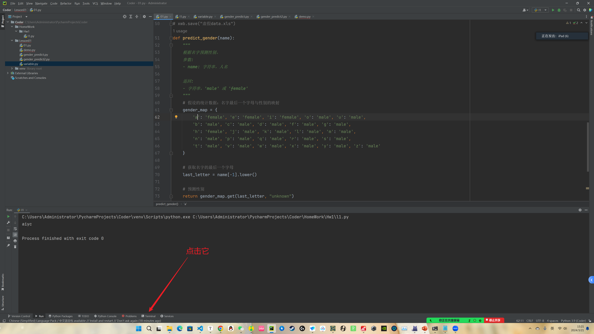
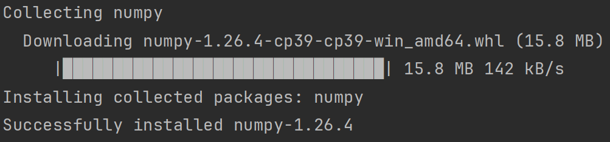
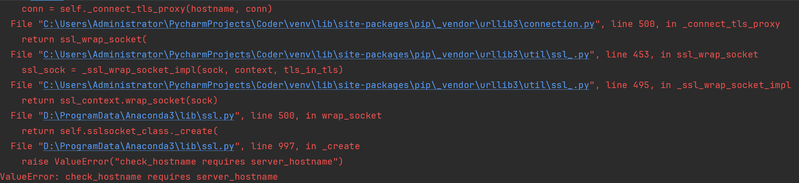
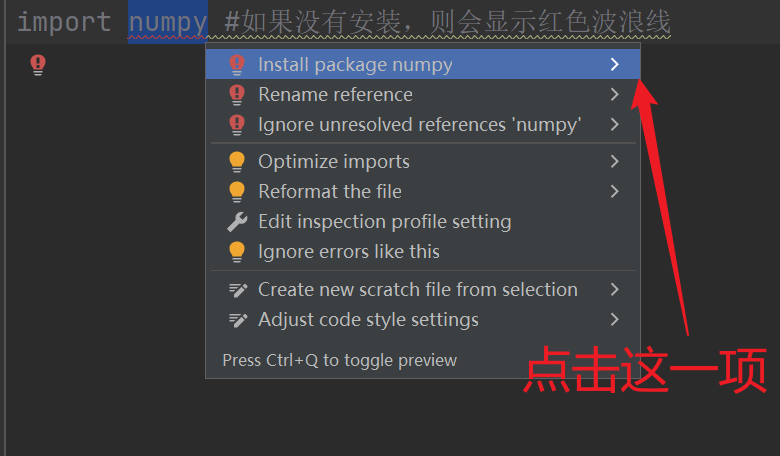

##  1. 通过命令行安装

无论是Mac还是Windows，都有两种命令行。一种是系统自带的命令行，另一种是Pycharm命令行。

这里，主要带你使用Pycharm命令行来安装，比较通用。

### 1.1 打开Pycharm



### 1.2 使用 pip 安装

比如我们这里需要安装 numpy 库，我们则使用如下命令：

```python
pip install numpy
#pip install 你需要安装的库名称
```

###  1.3 在 Terminal 执行命令








## 2. 通过Pycharm直接安装

### 2.1 随便一个Pycharm代码文件

随便一个Python的代码文件中，导入你所需要的库，无论是否安装。


### 2.2  开始安装

鼠标点击numpy库，然后按住键盘alt键 + Enter。



注意，无论哪种安装方式vpn网络问题都会对下载造成影响
