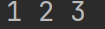
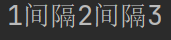

## 1. 理解变量——生活中的例子

### 1.1 从字面意思去理解

- 变：变化
- 量：大小

### 1.2 举个例子

假如，你是班级当中的课代表，每个月需要统计班级中每个学生的月考成绩。月考成绩会每个月一张纸，每张纸上都会依次记录每个学生的成绩越到成绩，例如：

1. 李雷    98分
2. 马冬梅    89分
3. 刘奕彤     96分
4. ......

某一天，老师要看刘奕彤 1月、2月、3月的成绩，这个时候作为课代表的你需要怎么办。——总不能直接把每个月的月考成绩单直接给老师，显然是不合适的。

我们应该把刘奕彤 1月、2月、3月的成绩抄写到单独的一张纸上，接着给老师。

那么，我们为什么不一开始直接为每一个学生分配一个信封呢？（也可以是档案袋）信封在一开始是扁的，当我们放东西（数据）进去之后，是不是鼓起来了？——是不是变化了？是不是有大小了呢？显然是的。

那么信封，是不是在我们当前所处的空间当中开辟空间，来存放数据并且说这是信封。

类似的有：冰箱，不也是在我们当前所处的空间中，开辟空间。

——所以，**<span style="color: orange">变量不就是在计算机的内存当中开辟空间，来存储数据。</span>**

**特点：** 变量的值会被覆盖，只会记着最后一个值。

## 2. 如何创建变量——赋值语句

1. **变量：通过变量名代表或引用某个值。**

- 女娲捏了泥人，泥人没有生命，女娲挥了挥手柳条，赋予给泥人生命。此时，泥人可以代表说是女娲的后人。「变量：泥人，值：女娲」
- 全国人民代表大会，中的人大代表，是由广大人民群众投票选举出来的。他们的权利不是自己获取的，所以他们可以说：我代表的是广大人民群众的意志。「变量：人大代表，值：人民群众」

2. 初始化赋值语句: **变量名 = 表达式** 「`=` 叫做：赋值运算符」

- 变量名：就是这个空间，我们叫它什么名字；
- 表达式：类似数学表达；

程序的运行逻辑：**从上到下，从右到左，最后才是赋值。**

::: code-tabs


@tab Code1

```python
x = 1 # 1. 赋值给了x, x 代表1
x = x + 10 #x + 10 等价于 1 + 10 最后得出 11， 11 赋值给x
print(x) # print 打印，输出
# 井号是用来注释，注解，解释某一行代码的功能或者作用 ，注释也可以用快捷键 ctrl + /
```
@tab Code2
```python
name1 = 'lelei'
name2 = name1
print(name2)

# 覆盖
name1 = 'lilei'
name1 = 'hanmeimei'
print(name1)
```
:::


## 3. 探究print

### 3.1 同时输出多个数据

```python
a = 1
b = 2
c = 3
print(a, b, c)
```



从输出的结果可以看出，print同时输出多个变量，每个值之间默认以空格间隔。

那么，我们可以修改这个默认空格间隔吗？——答案是显然可以的。

使用sep。

### 3.2 修改多个变量同时输出的间隔

```python
a = 1
b = 2
c = 3
print(a, b, c, sep='间隔')
```



### 3.3 end 修改print输出结尾的方式

::: code-tabs

@tab 原本

```python]
a = 1
b = 1
c = 1
print(a)
print(b)
print(c)

# ---output---
1
1
1
```

@tab 修改结尾 end 1

```python
a = 1
b = 1
c = 1
print(a, end='\n\n\n') # 多换行几个，\n 是换行的意思
print(b)
print(c)

# ---output---
1


1
1
```

@tab 修改 end 2

```python
a = 1
b = 2
c = 3
print(a, end='hugo is hugo') # 我们可以修改成不换行的字符串
print(b) # 这行的输出就会紧跟着上面的结尾输出
print(c)

#---output---
1hugo is hugo2
3
```

:::

### 3.4 end 和 sep 可以同时使用

```python
a = 1
b = 1
c = 1
print(a, b, c, sep='~', end=' love Python')

# ---output---
1~1~1 love Python
```


## 进阶的赋值方法

###  4.1 多个变量同时赋予相同的值

```python
a = b = c = 1 # 多个变量赋予相同的值
print(a, b, c)

#---output---
1 1 1
```

### 4.2 多个变量同时赋予不同的值

```python
a, b, c = 1, 2, 3 # 多个变量赋予不同的值
print(a, b, c)

#---output---
1 2 3
```


## 变量专项练习

### 1. 交换果汁

假如你有两个小孩，哥哥叫：Austin，弟弟叫：Jaden。

Austin 想喝果汁，Jaden 想喝可乐。哥哥和弟弟都有专属的杯子，不喜欢用对方的杯子。

家中仅剩一杯果汁、一杯可乐，你不小心把哥哥的杯子装了可乐，弟弟的杯子装了果汁。

问：如何交换哥哥与弟弟杯中的果汁？

::: code-tabs

@tab 样例代码

```python
Austin = "Coke"  # 该赋值可以理解为倒果汁的过程
Jaden = "juice"  # 该赋值可以理解为倒果汁的过程
print("Austin", Austin)
print("Jaden", Jaden)
# 待补充代码
print("Austin", Austin)
print("Jaden", Jaden)
```


@tab 提示

 ```python
 两种方法思路：
 
 方法一： 联想现实生活，现实生活中你会如何解决？
 
 > 现实生活中，我想你会引入一个空杯子来操作，那你会如何操作？思考后再思考代码中如何实现？
 
 方法二： Python 多个变量赋予不同值。
 a, b, c = 1, 2, 3
 ```


@tab answer 1

```python
Austin = "Coke"  # 该赋值可以理解为倒果汁的过程
Jaden = "juice"  # 该赋值可以理解为倒果汁的过程
print("Austin", Austin)
print("Jaden", Jaden)
empty_cup = Austin
Austin = Jaden
Jaden = empty_cup
print("Austin", Austin)
print("Jaden", Jaden)
```


@tab answer 2

```python
Austin = "Coke"  # 该赋值可以理解为倒果汁的过程
Jaden = "juice"  # 该赋值可以理解为倒果汁的过程
print("Austin", Austin)
print("Jaden", Jaden)
Austin, Jaden = Jaden, Austin
print("Austin", Austin)
print("Jaden", Jaden)
```


:::

### 2. 创建变量并输出

1. 输出效果：

    ```python
    Austin Jaden Alex Cava
    ```

    

2. 输出效果如下：

    ```python
    Austin$Jaden$Alex$Cava%
    ```

    

###  5. 变量的命名规则

- 大小写英文、数字和`_`的结合， 且不能用数字开头；
- 系统关键词不能做变量名使用（获取关键词列表：help(‘keywords’)）；
- Python 中的变量名区分大小写；
- 变量名不能包含空格， 但是可以使用下划线来分割其中的单词；
- 不要使用 Python 的内置函数做变量；

```python
Here is a list of the Python keywords.  Enter any keyword to get more help.

False               break               for                 not
None                class               from                or
True                continue            global              pass
__peg_parser__      def                 if                  raise
and                 del                 import              return
as                  elif                in                  try
assert              else                is                  while
async               except              lambda              with
await               finally             nonlocal            yield
```

::: code-tabs

@tab Code1

```python
n = 'A'
N = 'a'
print(n) # 如果变量不区分大小写的话，输出什么结果？——a
# 但是，它区分大小写，所以输出的是A

#out
A
```

@tab Code2

```python
# 数字不能开头
a121iy212dc1 = 'a' # 数字不能开头，除了开头，你想放哪就放哪。
```

@tab Code3

```python
user_name = 'aiyc'
```

@tab Code4

```python
print = 'aiyc' # 不能使用 Python 内置函数名命名
print(print) # Python 分不清
```

@tab Code5

```python
# 关键词不能当作变量名
await = 'aiyc'
print(await)
```

:::


