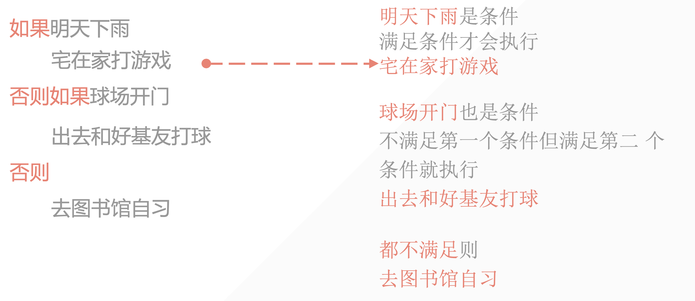
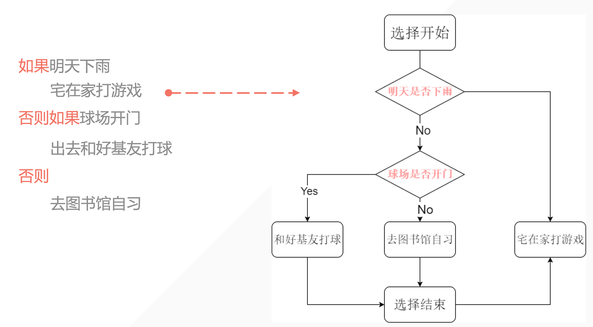

## 1. 前提：注意缩进

- 在 python 中相同位置的代码表示他们是同一个代码块

- 用四个空格或者一个 Tab 来表示缩进（切忌混用！）

```python
condition = True
while condition:
    a = 1
    if a < 10:
        print(f'a>>>{a}')
```

## 2. 条件判断——if/else





## 3. 例子：判断用户输入

```python
user_gender = input('请输入您的性别（F/M）')

if user_gender == 'F':
    print('WOMAN')
elif user_gender == 'M':
    print('MAN, WHAT CAN I SAY')
else:
    print('输入不正确，请输入 F 或 M')
```

1. 如果收到的是 F 则是 WOMAN

2. 如果收到的是 M 则是 MAN, WHAT CAN I SAY

3. 如果都不是，则返回 ‘’输入不正确，请输入 F 或 M’


- elif 是 else if 的缩写：
- 条件判断会从第一个开始判断，直到有一个符合条件的就不继续往下：
- 如果没有 else 语句且前面条件都不符合则输出什么？————这段条件判断语句什么都不shu'chu

::: warning

注意：判断使用双引号 ==  赋值使用单引号 =

:::
