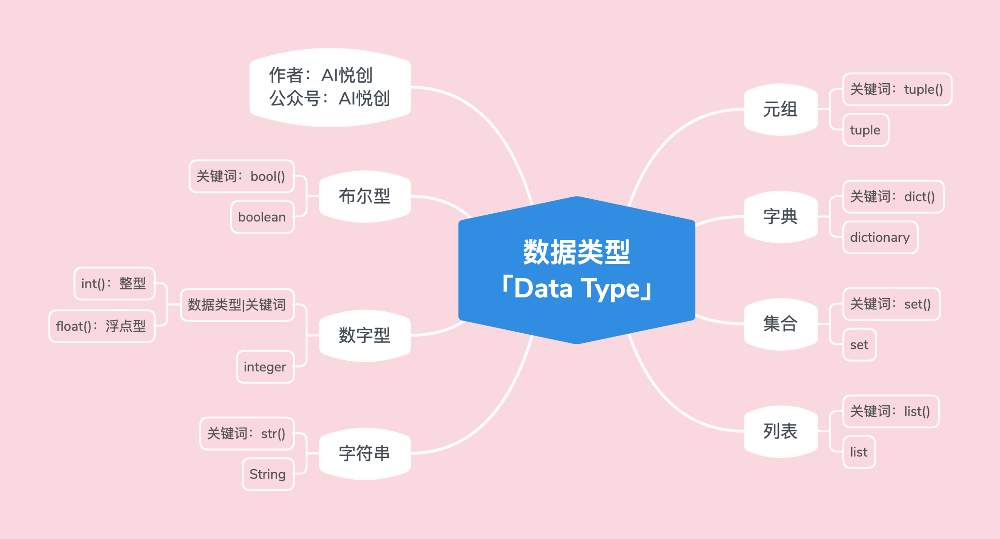

## 1. 数字型（int，float）

### 1.1 代码示例

1. 整型

```python
int_num = 1
t = type(int_num)
print("int num type is:>>>", t)
print("直接检测数据类型，并输出:>>>", type(int_num))

# output
int num type is:>>> <class 'int'>
直接检测数据类型，并输出:>>> <class 'int'>
```


2. 浮点数

```python
float_num = 1.5
t = type(float_num)
print(float_num)
print("float num type is:>>>", t)
print("直接检测数据类型，并输出:>>>", type(float_num))

# output
1.5
float num type is:>>> <class 'float'>
直接检测数据类型，并输出:>>> <class 'float'>
```


## 2. 字符串（str）

### 2.1 代码示例

```python
string = 'Hello Dailyrecord4ryan'
t = type(string)
print(string)
print("string type is:>>>", t)
print("直接检测数据类型，并输出:>>>", type(string))

# output
Hello Dailyrecord4ryan
string type is:>>> <class 'str'>
直接检测数据类型，并输出:>>> <class 'str'>
```

 ### 2.2 字符串的三大特性

1. 有序性
    1. 从左到右，下标是从0开始；
    2. 从右到左，下标是从-1开始；
    3. 引号里面出现，都算一个下标；
2.  不可变性
    1. 字符串被创建出来之后，就不能被改变；
    2. 注意：我们说的不可变，是代码运行的过程当中，不能有对字符串修改、添加、删除之类的操作；
3. 任意字符：
    1. 键盘上可以输入的字符，都可以是字符串的元素；
    2. 字符放到字符串中，都将成为字符串。（也就是：里面的每一个元素都可以称为：子字符）；

## 3. 列表

### 3.1 代码示例

```python
list = ['hello dailyrecord4ryan', 1, 1.1, ("look", 'book', 11), [12, '汉堡包'], True, False]
t = type(list)

print(list)
print("list type is:>>>", t)
print("直接检测数据类型，并输出:>>>", type(list))

# output 
['hello dailyrecord4ryan', 1, 1.1, ('look', 'book', 11), [12, '汉堡包'], True, False]
list type is:>>> <class 'list'>
直接检测数据类型，并输出:>>> <class 'list'>
```

### 3.2 列表的三大特性

1. 有序性
    1. 从左到有，下标是从0开始；
    2. 从右到左，下表是从-1开始；
    3. 列表的每个元素算一个：
        1. 比如：list = `['dailyrecord4ryan', 12]`;
        2. 上面 list 有两个元素，下标分别是：
            1. `dailyrecord4ryan`是下标0（从左到右），也是下标-2（从右到左）；
            2. `12`是下标1（从左到右），也是下标-1（从右到左）；
2. 可变性：在程序运行的过程当中，列表可以改变（添加、删除、修改）
3. 任意数据类型：注意，这里所说的任意数据类型，指的是Python所拥有的数据类型；

::: details Python所拥有的数据类型（下面只包含基础类型）



:::

## 4. 元组(Tuple)

### 4.1 代码示例

```python
tup = (1, 2, 3, 4, 'aiyc', 1.1, [1, 2, 3, 4])
t = type(tup)
print(tup)
print('tup type is:>>>', t)
print('直接检测数据类型，并输出:>>>', type(tup))

# output
(1, 2, 3, 4, 'aiyc', 1.1, [1, 2, 3, 4])
tup type is:>>> <class 'tuple'>
直接检测数据类型，并输出:>>> <class 'tuple'>
```

### 4.2 元组的三大特性

1. 有序性

    1. 从左到右，下标是从0开始

    2. 从右到左，下表是从-1开始

        1. 比如`tup=('dailyrecord4ryan', 12)`

        2. 上面 tup 有两个元素，下标分别是：

            1. `dailyrecord4ryan`是下标0（从左到右），也是下标-2（从右到左）；

            2. `12`是下标1（从左到右），也是下标-1（从右到左）；

                

2. 不可变性

    1. 元组被创建出来之后，就不能改变；

    2. 注意：我们说的不可变，是在代码运行当中，不能有对元组修改、添加、删除之类的操作；

        

3. 任意数据类型：注意，这里所说的任意数据类型，指的是Python所拥有的数据类型；

## 5. 探究（元组&列表）

::: info 为什么有列表，还需要元组

列表和元组到底用哪一个呢？

:::