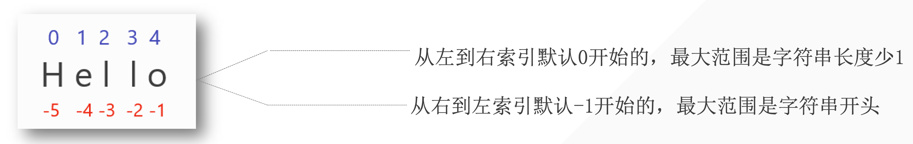
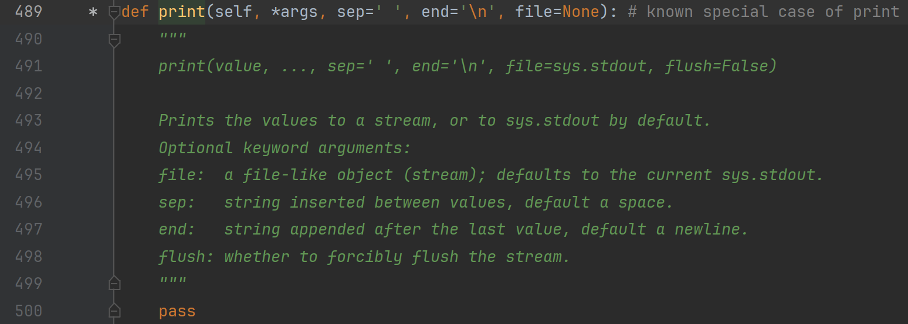

## 1. 字符串的定义

字符串是由字母、数字和特殊字符来组成的序列



## 2. 创建字符串

如何创建字符串？

————使用**<span style="color : orange"> 单引号、双引号</span>**或者**<span style="color : orange"> 三引号</span>**。

```python
name = 'ryan'
number = '8'
paragraph = '''hello, ryan.
nice to meet u'''
paragraph_two  = """Hi, ryan
nice to meet u 2"""
```

为什么Python同时支持三种创建字符串的方法

```python
string = 'I am Ryan' # 在英文中的常规表达式
print(string)
```

但是英文当中可以缩写如下：

```python
string = 'I'm Ryan.' # 在英文中的也可以如此缩写
print(string)

# output
  File "C:\Users\Administrator\PycharmProjects\Coder\Python\code4.py", line 11
    string = 'I'm Ryan.' # 在英文中的也可以如此缩写
                ^
SyntaxError: invalid syntax
```

因为，开头是单引号，所以Python会寻找到下一个第一次出现的单引号进行匹配。而第一个单引号在字符串的末尾，所以导致整个字符串异常。（完全没有博爱过字符串全部内容）

如何解决上面描述的问题呢？——使用双引号。

```python
string = "I'm Ryan." # 外面使用双引号包裹即可
print(string)

# output
I'm Ryan.
```

- 有时候我们需要字符串里面有单引号或双引号，此时发挥作用：**<span style = "color : orange">单双引号混用，是第一个原因</span>**那么三引号呢？
    假设我们现在需要存储如下文本：

    ```python
    我们有时候不仅仅要看选择项以内的答案，也要去思考选择项以外的答案。——AI悦创
    
    浅者见浅，深者见深——黄家宝
    
    起的最早的是理想主义者，跑的最快的是骗子，而胆子最大的是那些冒险家，害怕错过一切，疯狂往里冲的是韭菜，而真正的成功者，可能还没有入场。
    
    先实现功能，再去优化，否则一切会很乱。——AI悦创
    
    凡是你不能清晰写下来的东西，都是你还没有真正理解的东西
    ```

    放入字符串，我们如何在Python代码实现呢？

    ::: tabs-code

    @tab 单引号

    ```python
    string1 = '我们有时候不仅仅要看选择项以内的答案，也要去思考选择项以外的答案。——AI悦创
    
    浅者见浅，深者见深——黄家宝
    
    起的最早的是理想主义者，跑的最快的是骗子，而胆子最大的是那些冒险家，害怕错过一切，疯狂往里冲的是韭菜，而真正的成功者，可能还没有入场。
    
    先实现功能，再去优化，否则一切会很乱。——AI悦创
    
    凡是你不能清晰写下来的东西，都是你还没有真正理解的东西'
    print(string1)
    
    #output
      File "C:\Users\Administrator\PycharmProjects\Coder\Python\code4.py", line 26
        string1 = '我们有时候不仅仅要看选择项以内的答案，也要去思考选择项以外的答案。——AI悦创
                                                                                                                                    ^
    SyntaxError: EOL while scanning string literal
    ```

    @tab 双引号

    ```python
    string1 = "我们有时候不仅仅要看选择项以内的答案，也要去思考选择项以外的答案。——AI悦创
    
    浅者见浅，深者见深——黄家宝
    
    起的最早的是理想主义者，跑的最快的是骗子，而胆子最大的是那些冒险家，害怕错过一切，疯狂往里冲的是韭菜，而真正的成功者，可能还没有入场。
    
    先实现功能，再去优化，否则一切会很乱。——AI悦创
    
    凡是你不能清晰写下来的东西，都是你还没有真正理解的东西"
    print(string1)
    
    #output
      File "C:\Users\Administrator\PycharmProjects\Coder\Python\code4.py", line 26
        string1 = "我们有时候不仅仅要看选择项以内的答案，也要去思考选择项以外的答案。——AI悦创
                                                                                                                                    ^
    SyntaxError: EOL while scanning string literal
    ```

    :::

- 由此可见，如果直接使用单引号或者双引号会出现报错，当然我们可以在每一行包括无文本的空行的后面加上‘\’（此效果会将所有行拼接在一起）

```python
string1 = '我们有时候不仅仅要看选择项以内的答案，也要去思考选择项以外的答案。——AI悦创\
\
浅者见浅，深者见深——黄家宝\
\
起的最早的是理想主义者，跑的最快的是骗子，而胆子最大的是那些冒险家，害怕错过一切，疯狂往里冲的是韭菜，而真正的成功者，可能还没有入场。\
\
先实现功能，再去优化，否则一切会很乱。——AI悦创\
\
凡是你不能清晰写下来的东西，都是你还没有真正理解的东西'#引号这行不用加反斜杠
print(string1)

# output
我们有时候不仅仅要看选择项以内的答案，也要去思考选择项以外的答案。——AI悦创浅者见浅，深者见深——黄家宝起的最早的是理想主义者，跑的最快的是骗子，而胆子最大的是那些冒险家，害怕错过一切，疯狂往里冲的是韭菜，而真正的成功者，可能还没有入场。先实现功能，再去优化，否则一切会很乱。——AI悦创凡是你不能清晰写下来的东西，都是你还没有真正理解的东西
```

通常，我们还可以使用三引号测试：

```python
string1 = '''我们有时候不仅仅要看选择项以内的答案，也要去思考选择项以外的答案。——AI悦创

浅者见浅，深者见深——黄家宝

起的最早的是理想主义者，跑的最快的是骗子，而胆子最大的是那些冒险家，害怕错过一切，疯狂往里冲的是韭菜，而真正的成功者，可能还没有入场。

先实现功能，再去优化，否则一切会很乱。——AI悦创

凡是你不能清晰写下来的东西，都是你还没有真正理解的东西'''
print(string1)
# output 

浅者见浅，深者见深——黄家宝

起的最早的是理想主义者，跑的最快的是骗子，而胆子最大的是那些冒险家，害怕错过一切，疯狂往里冲的是韭菜，而真正的成功者，可能还没有入场。

先实现功能，再去优化，否则一切会很乱。——AI悦创

凡是你不能清晰写下来的东西，都是你还没有真正理解的东西
```

  可以从上面的输出可知，原本什么格式，输出就是什么格式。（原样输出）（三个双引号的效果也是一样的）

-  **<span style=color:orange>三个单引号或者双引号，实现原样输出。</span>**
- **<span style=color:orange> 多行注释 </span>**

- **<span style=color:orange>单双三引号混用</span>**（代码略）




##  3. 字符串长度

如何获取一个字符串的长度呢？————使用`len()`

`len()`：返回字符串中字符长度或者字符数。

```python
paragraph = 'Hello, ryan.'
print(len(paragraph))

# output
12
```

在使用len获取字符串长度时，是从数字1开始数的。

## 4. 字符串中的字符获取

### 4.1 获取单个字符

```python
string = 'dailyrecord4ryan'
# 获取字符 d
select = string[0]
print(select)

# 提取 y
select = string[4]
print(select)

# n (使用三种方法实现）
select1 = string[15]
select2 = string[len(string)-1]
select3 = string[-1]
print(select1, select2, select3)

# output

d
y
n n n
```

### 4.2 获取多个连续字符（子字符串）

```python
string = 'dailyrecord4ryan'
"""

语法：string = 'dailyrecord4ryan'
     select = string[start: end]
     PS: end 记得 +1
"""

# 获取字符 daily
select = string[0:4] # dail
select = string[0:5] # daily
print(select)

# 提取 record
select = string[5:11]
print(select)

# 提取ryan
select = string[12:16]
print(select)

# output
daily
record
ryan
```

