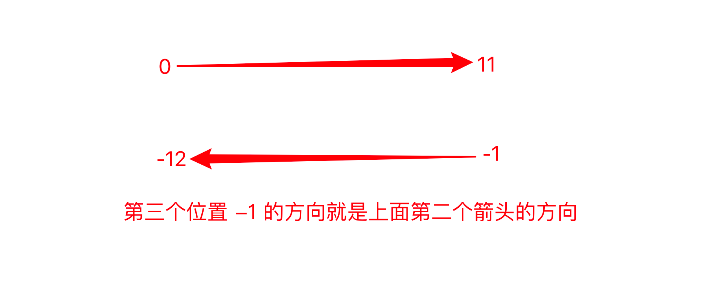

## 1. 字符串的定义

字符串是由字母、数字和特殊字符来组成的序列


## 2. 创建字符串

如何创建字符串？

————使用 **<span style="color : orange"> 单引号、双引号</span>** 或者 **<span style="color : orange"> 三引号</span>** 。

```python
name = 'ryan'
number = '8'
paragraph = '''hello, ryan.
nice to meet u'''
paragraph_two  = """Hi, ryan
nice to meet u 2"""
```

为什么Python同时支持三种创建字符串的方法

```python
string = 'I am Ryan' # 在英文中的常规表达式
print(string)
```

但是英文当中可以缩写如下：

```python
string = 'I'm Ryan.' # 在英文中的也可以如此缩写
print(string)

# output
  File "C:\Users\Administrator\PycharmProjects\Coder\Python\code4.py", line 11
    string = 'I'm Ryan.' # 在英文中的也可以如此缩写
                ^
SyntaxError: invalid syntax
```

因为，开头是单引号，所以Python会寻找到下一个第一次出现的单引号进行匹配。而第一个单引号在字符串的末尾，所以导致整个字符串异常。（完全没有博爱过字符串全部内容）

如何解决上面描述的问题呢？——使用双引号。

```python
string = "I'm Ryan." # 外面使用双引号包裹即可
print(string)

# output
I'm Ryan.
```

- 有时候我们需要字符串里面有单引号或双引号，此时发挥作用：**<span style = "color : orange">单双引号混用，是第一个原因</span>**那么三引号呢？
    假设我们现在需要存储如下文本：

    ```python
    我们有时候不仅仅要看选择项以内的答案，也要去思考选择项以外的答案。——AI悦创
    
    浅者见浅，深者见深——黄家宝
    
    起的最早的是理想主义者，跑的最快的是骗子，而胆子最大的是那些冒险家，害怕错过一切，疯狂往里冲的是韭菜，而真正的成功者，可能还没有入场。
    
    先实现功能，再去优化，否则一切会很乱。——AI悦创
    
    凡是你不能清晰写下来的东西，都是你还没有真正理解的东西
    ```

    放入字符串，我们如何在Python代码实现呢？

    ::: code-tabs

    @tab 单引号

    ```python
    string1 = '我们有时候不仅仅要看选择项以内的答案，也要去思考选择项以外的答案。——AI悦创
    
    浅者见浅，深者见深——黄家宝
    
    起的最早的是理想主义者，跑的最快的是骗子，而胆子最大的是那些冒险家，害怕错过一切，疯狂往里冲的是韭菜，而真正的成功者，可能还没有入场。
    
    先实现功能，再去优化，否则一切会很乱。——AI悦创
    
    凡是你不能清晰写下来的东西，都是你还没有真正理解的东西'
    print(string1)
    
    #output
      File "C:\Users\Administrator\PycharmProjects\Coder\Python\code4.py", line 26
        string1 = '我们有时候不仅仅要看选择项以内的答案，也要去思考选择项以外的答案。——AI悦创
                                                                                                                                    ^
    SyntaxError: EOL while scanning string literal
    ```

    @tab 双引号

    ```python
    string1 = "我们有时候不仅仅要看选择项以内的答案，也要去思考选择项以外的答案。——AI悦创
    
    浅者见浅，深者见深——黄家宝
    
    起的最早的是理想主义者，跑的最快的是骗子，而胆子最大的是那些冒险家，害怕错过一切，疯狂往里冲的是韭菜，而真正的成功者，可能还没有入场。
    
    先实现功能，再去优化，否则一切会很乱。——AI悦创
    
    凡是你不能清晰写下来的东西，都是你还没有真正理解的东西"
    print(string1)
    
    #output
      File "C:\Users\Administrator\PycharmProjects\Coder\Python\code4.py", line 26
        string1 = "我们有时候不仅仅要看选择项以内的答案，也要去思考选择项以外的答案。——AI悦创
                                                                                                                                    ^
    SyntaxError: EOL while scanning string literal
    ```

    :::

- 由此可见，如果直接使用单引号或者双引号会出现报错，当然我们可以在每一行包括无文本的空行的后面加上‘\’（此效果会将所有行拼接在一起）

```python
string1 = '我们有时候不仅仅要看选择项以内的答案，也要去思考选择项以外的答案。——AI悦创\
\
浅者见浅，深者见深——黄家宝\
\
起的最早的是理想主义者，跑的最快的是骗子，而胆子最大的是那些冒险家，害怕错过一切，疯狂往里冲的是韭菜，而真正的成功者，可能还没有入场。\
\
先实现功能，再去优化，否则一切会很乱。——AI悦创\
\
凡是你不能清晰写下来的东西，都是你还没有真正理解的东西'#引号这行不用加反斜杠
print(string1)

# output
我们有时候不仅仅要看选择项以内的答案，也要去思考选择项以外的答案。——AI悦创浅者见浅，深者见深——黄家宝起的最早的是理想主义者，跑的最快的是骗子，而胆子最大的是那些冒险家，害怕错过一切，疯狂往里冲的是韭菜，而真正的成功者，可能还没有入场。先实现功能，再去优化，否则一切会很乱。——AI悦创凡是你不能清晰写下来的东西，都是你还没有真正理解的东西
```

通常，我们还可以使用三引号测试：

```python
string1 = '''我们有时候不仅仅要看选择项以内的答案，也要去思考选择项以外的答案。——AI悦创

浅者见浅，深者见深——黄家宝

起的最早的是理想主义者，跑的最快的是骗子，而胆子最大的是那些冒险家，害怕错过一切，疯狂往里冲的是韭菜，而真正的成功者，可能还没有入场。

先实现功能，再去优化，否则一切会很乱。——AI悦创

凡是你不能清晰写下来的东西，都是你还没有真正理解的东西'''
print(string1)
# output 

浅者见浅，深者见深——黄家宝

起的最早的是理想主义者，跑的最快的是骗子，而胆子最大的是那些冒险家，害怕错过一切，疯狂往里冲的是韭菜，而真正的成功者，可能还没有入场。

先实现功能，再去优化，否则一切会很乱。——AI悦创

凡是你不能清晰写下来的东西，都是你还没有真正理解的东西
```

  可以从上面的输出可知，原本什么格式，输出就是什么格式。（原样输出）（三个双引号的效果也是一样的）

-  **<span style=color:orange>三个单引号或者双引号，实现原样输出。</span>**
- **<span style=color:orange> 多行注释 </span>**

- **<span style=color:orange>单双三引号混用</span>**（代码略）


##  3. 字符串长度

如何获取一个字符串的长度呢？————使用`len()`

`len()`：返回字符串中字符长度或者字符数。

```python
paragraph = 'Hello, ryan.'
print(len(paragraph))

# output
12
```

在使用len获取字符串长度时，是从数字1开始数的。

## 4. 字符串中的字符获取

### 4.1 获取单个字符

```python
string = 'dailyrecord4ryan'
# 获取字符 d
select = string[0]
print(select)

# 提取 y
select = string[4]
print(select)

# n (使用三种方法实现）
select1 = string[15]
select2 = string[len(string)-1]
select3 = string[-1]
print(select1, select2, select3)

# output

d
y
n n n
```

### 4.2 获取多个连续字符（子字符串）

```python
string = 'dailyrecord4ryan'
"""

语法：string = 'dailyrecord4ryan'
     select = string[start: end]
     PS: end 记得 +1
"""

# 获取字符 daily
select = string[0:4] # dail
select = string[0:5] # daily
print(select)

# 提取 record
select = string[5:11]
print(select)

# 提取ryan
select = string[12:16]
print(select)

# output
daily
record
ryan
```

### 4.3 获取多个不连续的字符

```python
string = '0123456789'
"""
语法：string = '0123456789'
select = string[start: end: sep]
PS: end 记得 +1 
"""

# 获取字符 02468
select = string[0:len(string):2]
print(select)

# 提取 13579
select = string[1:len(string):2]
print(select)


string1 = 'bornforthis'
# 提取 bnri
select = string1[0:len(string1):3]
print(select)

# 提取 ofts
select = string1[1:len(string1):3]
print(select)

# output
02468
13579
bnri
ofts
```

### 4.4 优化

如果我们要提取的字符是从字符从开头到结尾，则我们可以省略开头和结尾，留空即可。

所以4.3小节的代码可以等价于如下代码：

```python
string = '0123456789'
"""

语法：string = "0123456789"
select = string[::sep]
PS: end 记得 +1

"""

select = string[::2] # 取偶数
print(select)

select = string[1::2] # 取奇数
print(select)


string = "bornforthis"

select = string[::3] # 提取 bnri
print(select)

select = string[1::3] # 提取 ofts
print(select)
```

### 4.5  字符串的倒序

### 4.5.1 实现

字符串的第三个位置，控制的是字符提取的方向。默认为正数1，如果我们想把字符串进行反转操作，我们可以改成-1，则我们可以将字符串从倒序第一的位置（-1）进行反方向输出

::: tips

正负控制方向，数字大小控制步长。

:::

```python
string = "bornforthis"
reverse = string[::-1]
print(reverse)

# output
sihtrofnrob
```

### 4.5.2 存

在的bug

:::warning 思考

上面代码`string[::-1]`前两位省略了啥数字？尝试填上去

:::

你有可能会写：

```python
string = "bornforthis"

reverse = string[0:11:-1]
print(reverse)

# output
没有结果
```

然而既没有报错也没有输出结果，这是为什么？


那么应该怎么办呢？


### 4.5.3 解决方法

1. 方法一：调换位置

先思考存在什么问题？————少了一个字符

```python
string = "bornforthis"

reverse = string[11:0:-1]
print(reverse)

# output
sihtrofnro
```

为什么少了一个字符？

————存在一个bug，因为结束是0，但是字符获取操作([::])中的第一个和第二个位置分别为“左闭右开“，也就是说要想覆盖到0位置，中间的数字必须是0左边一个数字也就是-1，然而-1却又是最右边的位置，这样固然是不行的。

难道我们只能不写第二个位置，得到完整的倒序字符？————`reverse = string[11::-1]`

这显然没有解决我们刚刚提出的问————前两位省略了啥数字？

2.  方法二：重新开始结尾

重新写开始结尾

想想字符串的有序性，从右到左。

至于为什么要纠结前两个空的数字是什么————之后可能只要提取字符串的一部分

```python
string = "bornforthis"

reverse = string[-1:-12:-1]
print(reverse)

# output
sihtrofnrob
```



小试牛刀： 获取 rofn

```python
string = "bornforthis"

# 获取rofn
select = string[-5:-9:-1]
print(select)

selcet = string[6:2:-1]
print(select)

# output
rofn
rofn
```

## 5. 字符串的内置方法

### 5.1 upper()

- 将字符串的内容，全部转换成大写。

```python
# upper
# 将字符串的内容，全部转换成大写。
string = "bornforthis"
upper_string = string.upper()
print(upper_string)

# output
BORNFORTHIS
```

### 5.2 lower()

- 将字符串的内容，全部转换成小写。

```python
# .lower()
# 将字符串的内容，全部转换成小写。
string = "bornforthis"
lower_string = string.lower()
print(lower_string)

# output
bornforthis
```

### 5.3 capitalize()

- 将首字母，转换成大写。（只对第一个字母大写，其他后面的不会变成大写

```python
# .capitalize()
# 将首字母，转换成大写。（只对第一个字母大写，其他后面的不会变成大写）
string = "bornforthis to aiyc"
capitalize_string = string.capitalize()
print(capitalize_string)

# output
Bornforthis to aiyc
```

### 5.4 titile()

- 将字符串中的每个单词的首字母，转换成大写
- 且不管是什么间隔，都会转换成首字母大写

```python
# .title()
# 将字符串中的每个单词的首字母，转换成大写。
pystring = "bornforthis to aiyc"
title_string = string.title()
print(title_string)

string = "bornforthis-to-aiyc" # 不管是什么间隔，都会转换成首字母大写
title_string = string.title()
print(title_string)

# output
Bornforthis To Aiyc
Bornforthis-To-Aiyc
```

### 5.5 startwith()

- 检测字符串是不是以特定字符或单词开头，返回布尔值。

```python
# .startswith()
# 检测字符串是不是以特定字符或单词开头，返回布尔值。

string = 'bornforthis'
startswith_string = string.startswith("b")
print(startswith_string)

string = 'bornforthis'
startswith_string = string.startswith("bo")
print(startswith_string)

string = 'bornforthis'
startswith_string = string.startswith("p")
print(startswith_string)

string = 'bornforthis'
startswith_string = string.startswith("b1")
print(startswith_string)

# output
True
True
False
False
```

### 5.6 endswith()

- 检测字符串是不是以特定字符或单词结尾，返回布尔值。

```python
# .endswith()
# 检测字符串是不是以特定字符或单词结尾，返回布尔值。
string = "bornforthis"
endswith_string = string.endswith("s")
print(endswith_string)

string = "bornforthis"
endswith_string = string.endswith("is")
print(endswith_string)

string = "bornforthis"
endswith_string = string.endswith("i")
print(endswith_string)

string = "bornforthis"
endswith_string = string.endswith("s6")
print(endswith_string)

# output
True
True
False
False
```

### 5.7 count()

- 计算特定字符或单词在目标字符串中存在的次数。

```python
# .count()
# 计算特定字符或单词在目标字符串中存在的次数。
string = "bornforthis"
count_string = string.count('r')
print(count_string)

string = "bornforthis"
count_string = string.count('or')
print(count_string)

string = "bornforthis"
count_string = string.count('a')
print(count_string)

string = "bornforthis"
count_string = string.count('ap')
print(count_string)

# output
2
2
0
0
```

### 5.8 find()

- 寻找目标字符或单词在字符串中第一次出现的下标。

- 即使重复出现，也只是返回第一次出现的下标

- 如果是查询单词，那么 find() 返回目标单词的第一个字符下标。

- 如果，查询字符或单词不存在，则返回 -1。

```python
# .find()
# 寻找目标字符或单词在字符串中第一次出现的下标。
# 即使重复出现，也只是返回第一次出现的下标。
# 如果是查询单词，那么 find() 返回目标单词的第一个字符下标。
# 如果，查询字符或单词不存在，则返回 -1。

string = 'bornforthis'
new_string= string.find('b')
print(new_string)

string = 'bornforthis'
new_string = string.find('a')
print(new_string)

string = 'bornforthis'
new_string = string.find('for')
print(new_string)

string = 'bornforthis'
new_string = string.find('aiyc')
print(new_string)

# output
0
-1
4
-1
```

###  5.9 index()

- 寻找目标字符或单词在特定字符串中，第一次出现的下标。如果是查找单词，那么 index() 返回目标单词的第一个字符的下标。
- 如果，查询的字符或单词不存在，则报错。

```python
# .index()
# 寻找目标字符或单词在特定字符串中，第一次出现的下标。如果是查找单词，那么 index() 返回目标单词的第一个字符的下标。
# 如果，查询的字符或单词不存在，则报错。

string = "bornforthis"
result = string.index("b")
print(result)

# output
0

string  = 'bornforthis'
result  = string.index('a')
print(result)

# output
Traceback (most recent call last):
  File "C:\Users\Administrator\PycharmProjects\Coder\Python\code4.py", line 381, in <module>
    result  = string.index('a')
ValueError: substring not found

string = "bornforthis"
result = string.index("for")
print(result)

# output
4

string = 'bornforthis'
result = string.index('aiyc')
print(result)

# output
File "C:\Users\Administrator\PycharmProjects\Coder\Python\code4.py", line 385
    Traceback (most recent call last):
                    ^
SyntaxError: invalid syntax
```

### 5.10  isdigit()

- 判断字符串是不是纯数字字符串，字符串中但凡有一个字符是非数字，则返回 False。

```python
# .isdigit()
# 判断字符串是不是纯数字字符串，字符串中但凡有一个字符是非数字，则返回 False。
string = '12345678'
result = string.isdigit()
print(result)

string = '123 45678' # 中间有空格，不是纯数字字符串
result = string.isdigit()
print(result)

# output
True
False
```

### 5.11 isalpha()

- 预判字符串是不是纯字母字符串，字符串但凡有一个非字母的，则返回False。

```python
# .isalpha()
# 预判字符串是不是纯字母字符串，字符串但凡有一个非字母的，则返回False。
string = 'bornforthis'
result = string.isalpha()
print(result)

string = 'born forthis'
result = string.isalpha()
print(result)

# output
True
False
```

### 5.12 isalnum()

- 判断字符串是不是纯数字或纯字母、纯数字字母字符串，字符串中一旦出现非数字非字母元素，则返回 False。

```python
# .isalnum()
# 判断字符串是不是纯数字或纯字母、纯数字字母字符串，字符串中一旦出现非数字非字母元素，则返回 False。

string = 'bornforthis'
boolean = string.isalnum()
print(boolean)

string = '12345678'
boolean = string.isalnum()
print(boolean)

string = 'bornforthis8888888'
boolean = string.isalnum()
print(boolean)

string = 'bornforthis 8888888'
boolean = string.isalnum()
print(boolean)

# output
True
True
True
False
```

### 5.13 isupper()

- 判断字符串中的字符否全大写，全大写则返回 True， 否则返回 False。

```python
# .isupper()
# 判断字符串中的字符否全大写，全大写则返回 True， 否则返回 False。

string = 'BORNFORTHIS'
boolean = string.isupper()
print(boolean)

string = 'BORNFORTHIS12-'
boolean = string.isupper()
print(boolean)

string = 'BORNFOforthis'
boolean = string.isupper()
print(boolean)

string = 'bornforthis'
boolean = string.isupper()
print(boolean)

# output
True
True
False
False
```

### 5.14 islower()

- 判断字符串是不是全小写，全小写则返回True,否则则返回False

```python
# .islower()
# 判断字符串是不是全小写，全小写则返回True,否则则返回False

string = 'bornforthis'
boolean = string.islower()
print(boolean)

string = 'bornforthis123-'
boolean = string.islower()
print(boolean)

string = 'bornforthisA121-'
boolean = string.islower()
print(boolean)

# output
True
True
False
```

###  5.15 isspace()

- 判断字符串是否为纯空格，多少个空格都可以。纯空格则返回 True，否则返回 False。

```python
# .isspace()
# 判断字符串是否为纯空格，多少个空格都可以。纯空格则返回 True，否则返回 False。

string = "     "
boolean = string.isspace()
print(boolean)

# output
True

string = ""
boolean = string.isspace()
print(boolean)

# output
False

string = 'bornforthis'
boolean = string.isspace()
print(boolean)

# output
False
```

### 5.16 strip()

- 默认去掉目标字符串的前后空白字符，如果指定参数，则去掉指定字符。

```python
# .strip()
# 默认去掉目标字符串的前后空白字符，如果指定参数，则去掉指定字符。

string = '   bornforthis   '
strip_string = string.strip()
print("原本的字符串：", string)
print("去掉前后空白字符串后：", strip_string)

# output
原本的字符串：    bornforthis
去掉前后空白字符串后： bornforthis

string = "-----bornforthis-----"
strip_string = string.strip('-')
print("原本的字符串：", string)
print("去掉前后'-'字符后：", strip_string)
# output
原本的字符串： -----bornforthis-----
去掉前后'-'字符后： bornforthis

string = "--- --bornforthis-- ---"
strip_string = string.strip('-') # 只取掉连续的减号
print("原本的字符串：", string)
print("去掉前后'-'字符后:", strip_string)

# output
原本的字符串： --- --bornforthis-- ---
去掉前后'-'字符后:  --bornforthis--

# 如果想去掉减号和空格呢？
string = '--- --bornforthis-- ---'
strip_string = string.strip('- ') # 填入要去掉的字符（不计入先后顺序）
print("原本的字符串:", string)
print("去掉前后'- '字符后:", strip_string)

# output
原本的字符串: --- --bornforthis-- ---
去掉前后'- '字符后: bornforthis
```

### 5.17 lstrip()

- 默认去掉字符左边的空白字符，如果指定参数，则去掉左边的指定字符。

```python
# .lstrip()
# 默认去掉字符串左边的空白字符，如果指定参数，则去掉左边的指定字符。

string = '   bornforthis   '
lstrip_string = string.lstrip()
print("原本的字符串：", string)
print("去掉左边空白字符串后：", lstrip_string)

# output
原本的字符串：    bornforthis
去掉左边空白字符串后： bornforthis

string = "----bornforthis----"
lstrip_string = string.lstrip('-')
print("原本的字符串：", string)
print("去掉左边'-'后:", lstrip_string)

# output
原本的字符串： ----bornforthis----
去掉左边'-'后: bornforthis----

string = '-- --bornforthis-- --'
lstrip_string = string.lstrip('- ') # 不分先后顺序
print("原本的字符串:", string)
print("去掉左边:", lstrip_string)

# output
原本的字符串: -- --bornforthis-- --
去掉左边: bornforthis-- --
```

### 5.18 rstrip()

- 默认去掉字符串右边的空白字符，如果指定参数，则去掉右边的指定字符。

```python
# .rstrip()
# 默认去掉字符串右边的空白字符，如果指定参数，则去掉右边的指定字符。
string = '   bornforthis   '
rstrip_string = string.rstrip()
print("原本的字符串", string)
print("去掉右边空白字符后:", rstrip_string)

# output
原本的字符串    bornforthis
去掉右边空白字符后:    bornforthis

string = '----bornforthis----'
rstrip_string = string.rstrip('-')
print("原本的字符串:", string)
print("去掉右边'-'后:", rstrip_string)

# output
原本的字符串: ----bornforthis----
去掉右边'-'后: ----bornforthis

string = '-- --bornforthis-- --'
rstrip_string = string.rstrip("- ")
print("原本的字符串", string)
print("去掉右边'-'后", rstrip_string)

# output
原本的字符串 -- --bornforthis-- --
去掉右边'-'后 -- --bornforthis
```

### 5.19 replace()

`replace(old, new, count)`第一个位置传入待替换的旧（old）字符，第二个位置传入要替换的新的字符（new），默认替换全部，count控制替换次数。

```python
string = "    bornforthis    "
replace_string = string.replace(' ','*') # 把空白字符替换成 *
print("原本的字符串:", string)
print("替换后:", replace_string)

# output
原本的字符串:     bornforthis
替换后: ****bornforthis****

string = 'ai-bornforthis-ai'
replace_string = string.replace('ai','love') # 把 ai 换成 love，默认全部替换
print("原本的字符串:", string)
print("替换后:", replace_string)

# output
原本的字符串: ai-bornforthis-ai
替换后: love-bornforthis-love

string = 'ai-bornforthis-ai'
replace_string = string.replace("ai","love", 1) # 只替换一次
print("原本的字符串:", string)
print("替换后:", replace_string)

# output
原本的字符串: ai-bornforthis-ai
替换后: love-bornforthis-ai
```

### 5.20 split()

`.split(sep, maxsplit)`以特定进行分割，默认空格分割。如果传入参数（sep），则以参数进行分割。返回分割后的列表。maxsplit用于控制分割几次。

```python
string = 'ai bornforthis'
split_string = string.split()
print("原本的字符串:", string)
print("分割后:", split_string)

# output
原本的字符串: ai bornforthis
分割后: ['ai', 'bornforthis']

string = 'ai-bornforthis-ai'
split_string = string.split('-') # 以 - 分割
print("原本的字符串:", string)
print("分割后:", split_string)

# output
原本的字符串: ai-bornforthis-ai
分割后: ['ai', 'bornforthis', 'ai']

string = 'ai-bornforthis-love'
split_string = string.split('-', 1)
print("原本的字符串:", string)
print("分割后:", split_string)

# output
原本的字符串: ai-bornforthis-love
分割后: ['ai', 'bornforthis-love']
```

::: warning

注意：使用split分割时，不管每个字符间隔几个空格间隔，都会将会正常的分割出来

```python
s = '1  2 3    4 5     6 7 8 9' # 中间任意数量的空格
new_s = s.split()
print(new_s)

# output
['1', '2', '3', '4', '5', '6', '7', '8', '9']


s = 'ai  bornforthis   ai   book'
new_s = s.split()
print(new_s)

# output
['ai', 'bornforthis', 'ai', 'book']
```

当我们指定任意间隔,  split 会严格按照我们指定的分割符号来分割，如下会多输出空字字符。

```python
s = 'ai  born    for  this ai    book'
new_s = s.split(' ')
print(new_s)

# output
['ai', '', 'born', '', '', '', 'for', '', 'this', 'ai', '', '', '', 'book']
```

::: 


### 5.21 rsplit()

`.rsplit(sep, maxsplit)`从字符右边进行分割，也可以传入参数（sep），进行指定分割。返回分隔后的列表。maxsplit 指定分割次数。

```python
string = 'ai-bornforthis-love'
rsplit_string = string.rsplit('-')
print("原本的字符串:", string)
print("分割后:", rsplit_string)

# output
原本的字符串: ai-bornforthis-love
分割后: ['ai', 'bornforthis', 'love']

string = 'ai-bornforthis-love'
rsplit_string = string.rsplit('-', 1)
print("原本的字符串:", string)
print("分割后:", rsplit_string)

# output
原本的字符串: ai-bornforthis-love
分割后: ['ai-bornforthis', 'love']
```

### 5.22 join()

以特定字符使字符串间隔

```python
string  = 'bornforthis'
join_string = '-'.join(string)
print("原本的字符串:", string)
print("拼接后:", join_string)

# output
原本的字符串: bornforthis
拼接后: b-o-r-n-f-o-r-t-h-i-s
```


## 6. 字符串的格式化

当我们想重复输出一连串同类型的字符串时，之前我们是这样输出的

```python
string1 = 'hi ryan, welcome to hangzhou.'
print(string1)
string2 = 'hi tom, welocome to guangdong.'
print(string2)
string3 = 'hi mike, welcome to changsha.'
print(string3)
```

- 显然，这样每次都得重新创建一个新的字符串，十分麻烦。

- 既然是同类型的语句，那我们可不可以拥有一个统一的模板呢？

```python
string = 'hi ryan, welcome to hangzhou.'
print(string)


name = 'ryan'
region = 'hangzhou'
string1 = 'hi '
string2 = ', welcome to '
string3 = '.'
result = string1 + name + string2 + region + string3
print(result)

# output
hi ryan, welcome to hangzhou.
hi ryan, welcome to hangzhou.
```

- 这样确实可以实现，但依然很麻烦。
- 字符串的加法会不会出现语法问题？

```python
string = 'monkey' + 100
print(string)

# output
Traceback (most recent call last):
  File "C:\Users\Administrator\PycharmProjects\Coder\Python\code4.py", line 805, in <module>
    string = 'monkey' + 100
TypeError: can only concatenate str (not "int") to str

string = 'monkey' + str(100)
print(string)

# output
monkey100
```

::: warning

在 python 中不同类型的数据类型不可以直接相加，除非强制转化为字符串。

:::

由此，**fomat** 就出现了。

### 6.1 format()

1. 单个花括号`{}`

    ```python
    string = "Hi {}, Welocme to Xiamen.".format('aiyc')
    print(string)
    
    string = "Hi {}, Welcome to Xiamen"
    print(string.format("Aiyc"))
    
    new_string = string.format("AIYC")
    print(new_string)
    
    # output
    Hi aiyc, Welocme to Xiamen.
    Hi Aiyc, Welcome to Xiamen
    Hi AIYC, Welcome to Xiamen
    ```

2.  一个花括号以上（按顺序填充）

```python
string = "Hi {}, Welcome to {}.".format("ryan", "hangzhou")
print(string)

string = "Hi {}, Welcome to {}."
print(string.format("Ryan", "hangzhou"))

string = "Hi {}, Welcome to {}."
format_string = string.format("RYAN", "hangzhou")
print(format_string)

# output
Hi ryan, Welcome to hangzhou.
Hi Ryan, Welcome to hangzhou.
Hi RYAN, Welcome to hangzhou.
```

3. 多个花括号指定位置

```python
string = "Hi {1}, Welcome to {0}.".format("Hangzhou", "ryan")
print(string)

string = "Hi {1}, Welcome to {0}."
print(string.format("Hangzhou", "Ryan"))

string = "Hi {1}, Welcome to {0}."
format_string = string.format("Hangzhou", "RYAN")
print(format_string)

# output
Hi ryan, Welcome to Hangzhou.
Hi Ryan, Welcome to Hangzhou.
Hi RYAN, Welcome to Hangzhou.
```

4. 参数指定

```python
string = "Hi {name}, Welcome to {region}.".format(name = "ryan", region = "Hangzhou")
print(string)

string = "Hi {name}, Welcome to {region}."
print(string.format(name = "Ryan", region = "Hangzhou"))

string = "Hi {name}, Welcome to {region}."
format_string = string.format(name = "RYAN", region = "Hangzhou")
print(format_string)

# output
Hi ryan, Welcome to Hangzhou.
Hi Ryan, Welcome to Hangzhou.
Hi RYAN, Welcome to Hangzhou.
```

5. 保留指定小数位

```python
string = "Money is {:.3f}".format(190) # .3f 保留三位小数
print(string)

string = "Money is {num:.3f}{l}".format(num = 190, l = "111") # 可以混合使用
print(string)

# output
Money is 190.000
Money is 190.000111
```

### 6.2 f

1. 直接读取变量

```python
name = 'ryan'
region = 'Hangzhou'
string = f"Hi {name}, Welcome to {region}."
print(string)

# output
Hi ryan, Welcome to Hangzhou.
```

2. 保留小数位

```python
money = 190
string = f"Money is {money:.3f}"
print(string)

# output
Money is 190.000
```

### 6.3 格式化

- `%d`: 整数
- `%s`: 字符串
- `%f`: 浮点数

1.  单个位置传入

```python
string = "Money is %d"
new_s = string % 13 
print(new_s)
print(string % 19)

string = "Money is %d" % 190
print(string)

# output
Money is 13
Money is 19
Money is 190
```

2. 多个位置传入

```python
string = "Money is %d %s"
new_s = string % (13, '发大财')
print(new_s)
print(string %(888, '暴富'))
string = "Money is %d %s" % (190, "超有钱")
print(string)

# output
Money is 13 发大财
Money is 888 暴富
Money is 190 超有钱
```

