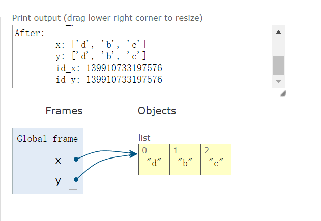
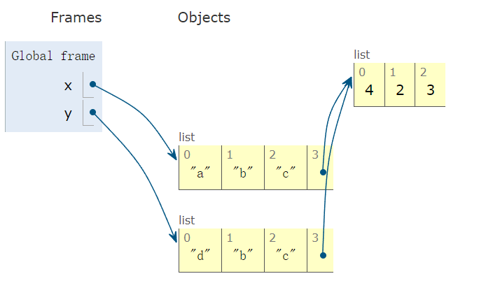
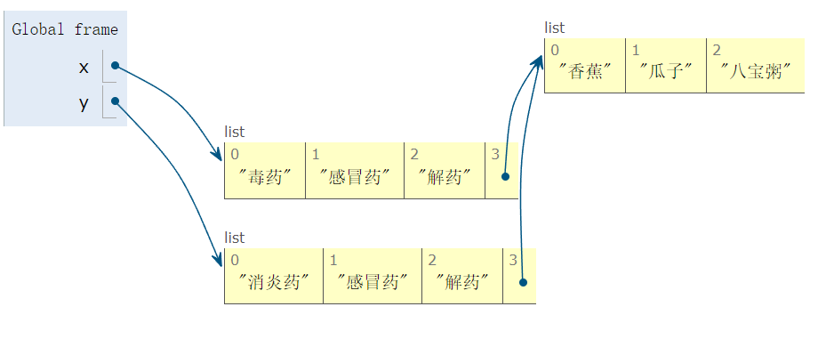
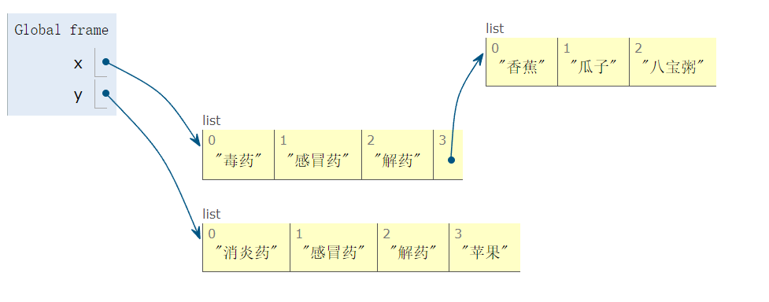

## 1. 列表结构

- 利用 **<span style="color: orange">中括号</span>**
- 列表内的元素用 **<span style="color: orange">逗号</span>** 隔开

- 注意是 **<span style="color: orange">英文输入法</span>** 下的逗号

```python
student1 = ['lilei', 18, 'class01', 201901]
student2 = ['hanmeimei', 19, 'class02', 201902]
```

列表的 **<span style="color: orange">可变性</span>** ：可以修改列表内的内容。

- 字符串强制转换成列表

```python
string_to_list = list('Bornforthis')
print(string_to_list)

# output
['B', 'o', 'r', 'n', 'f', 'o', 'r', 't', 'h', 'i', 's']
```

## 2. 获取列表中的某个元素

### 2.1 列表下标的组成

#### 2.1.1获取列表中的某个元素


中括号内指定元素位置

```python
grade = [98, 99, 95, 80]
print(grade[0])
print(grade[0] + grade[3])

# output
98
178
```

#### 2.1.2 获取列表中连续的几个元素


```python
numbers = [0, 1, 2, 3, 4, 5, 6, 7, 8, 9]
print(numbers[2:6])

# output
[2, 3, 4, 5]
```

#### 2.1.3 **<span style="color: red">获取</span>**列表中连续的几个元素


```python
numbers = [0, 1, 2, 3, 4, 5, 6, 7, 8, 9]
print(numbers[1:7:2])

# output
[1, 3, 5]
```

#### 2.1.4 列表的 **<span style="color: red">切片赋值</span>**

```python
In [1]: name = list('Python')

In [2]: name
Out[2]: ['P', 'y', 't', 'h', 'o', 'n']

In [3]: name[2:] = list('abc')

In [4]: name
Out[4]: ['P', 'y', 'a', 'b', 'c']

In [5]: numbers = [1, 5]

In [6]: numbers[1:1]
Out[6]: []

In [7]: numbers[1:1] = [2, 3, 4]

In [8]: numbers
Out[8]: [1, 2, 3, 4, 5]

In [9]: numbers[1:4]
Out[9]: [2, 3, 4]

In [10]: numbers[1:4] = []

In [11]: numbers
Out[11]: [1, 5]
```

#### 2.1.5 小试牛刀

获取用户输入两个值，一个是要插入的位置，一个是要插入这个位置的值。

- 给定下面列表

```python
numbers = [1, 2, 3, 4, 5, 6]
```

- 例子

```python
Enter position: 3
Enter value: 4
[1, 2, 3, 4, 5, 6]
```

- 代码

```python
numbers = [1, 2, 3, 5, 6]
p = int(input("Enter position:"))
v = int(input("Enter Value:"))
numbers[p:p] = [v]
print(numbers)

# output
Enter position: 3
Enter Value: 4
[1, 2, 3, 4, 5, 6]
```

#### 2.1.6 在列表的特定位置插入元素（.insert(index, element)）

`.insert(index, element)`是一个列表的基本表现方法，用于在列表的指定位置插入一个元素。

他的基本语法是：

```python
list.insert(index, element)
```

- `index`:指定要插入元素的位置。索引从 0 开始。如果指定的索引超出了列表的当前长度「不会报错」，则元素将被添加到列表的末尾。

- `element`:这是你想要插入列表的元素。

```python
numbers = [1, 2, 3, 5, 6]
numbers.insert(3, 4)
print(numbers) # [1, 2, 3, 4, 5, 6]

# output
# [1, 2, 3, 4, 5, 6]
```

#### 2.1.7 获取列表长度（len()）

使用 len（）函数返回列表中元素的个数

```python
# 获取列表长度，使用 len():
student_list = ['李雷', '韩梅梅', '马冬梅']
print(len(student_list))

# output
3
```

#### 2.1.8 修改列表单个元素

通过列表位置编号修改想要修改的元素（list[位置编号]）

```python
# 修改列表元素
name = ['lilei', 'hanmeimei']
name[0] = 'madongmei'
print(name)

# output
['madongmei', 'hanmeimei']
```

#### 2.1.9 修改列表多个元素

类似于前面的切片————list[start:end]，在中括号内起始和结束位置（中括号内左闭右开，因此右边位置得多往边缘方向挪动一位）

```python
# 多个元素修改
numbers = [0, 1, 2, 3, 4, 5, 6, 7, 8, 9, 0]
print('before:', numbers)

numbers[1:5] = ['one', 'two', 'three', 'four']
print('after:', numbers)

# output
before: [0, 1, 2, 3, 4, 5, 6, 7, 8, 9, 0]
after: [0, 'one', 'two', 'three', 'four', 5, 6, 7, 8, 9, 0]
```

字符串也可以被直接分割为元素，加入列表中

```python
# 多个修改的对象也可以是字符串
numbers = [0, 1, 2, 3, 4, 5, 6, 7, 8, 9, 10]
print('before:', numbers)

# 元素数量不一样 & 字符串自动拆开成列表
numbers[1:5] = 'bornforthis'
print('after:', numbers)

# output
before: [0, 1, 2, 3, 4, 5, 6, 7, 8, 9, 10]
after: [0, 'b', 'o', 'r', 'n', 'f', 'o', 'r', 't', 'h', 'i', 's', 5, 6, 7, 8, 9, 10]
```

注意一点的是：即使选择的位置长度小于塞入的元素，最终也会将所有新元素塞入列表


::: info 总结

```python
下面为可以塞入列表的类型
- 列表
- 元组
- 集合
- 字符串
- 字典（放进去的是key）
```

:::

::: warning

**<span style="color: orange">布尔型</span>** 不可以作为列表元素的修改

```python
numbers = [0, 1, 2, 3, 4, 5, 6, 7, 8, 9, 10]
print('before:', numbers)

numbers[1:5] = True
print('after:', numbers)

# output
Traceback (most recent call last):
  File "C:\Users\Administrator\PycharmProjects\Coder\Python\code5.py", line 112, in <module>
    numbers[1:5] = True
TypeError: can only assign an iterable
```

:::

#### 2.1.10 向列表末尾添加单个元素 （.append()）


```python
# 添加单个元素
lst = ['钥匙', '毒药']
print('before:', lst)
lst.append('解药')
print('after:', lst)

# output
after: ['钥匙', '毒药', '解药']
```

#### 2.1.11列表末尾添加多个元素（.extend()）

```python
# 添加多个元素
inventory = ['钥匙', '毒药', '解药']
inventory.extend(['迷药', '感冒药'])
print(inventory)

# output
['钥匙', '毒药', '解药', '迷药', '感冒药']
```

#### 2.1.12 删除列表中的元素1（del）

```python
# 删除列表中的元素
# del
# del 需要指定列表中要删除的单个元素或者多个元素，如果不指定元素，则会删除整个列表

student_list = ['李雷', '韩梅梅', '马冬梅']
del student_list[0]
print(student_list)

# output
['韩梅梅', '马冬梅']


student_list = ['李雷', '韩梅梅', '马冬梅']
del student_list # 不指定元素
print(student_list)

# output
Traceback (most recent call last):
  File "C:\Users\Administrator\PycharmProjects\Coder\Python\code5.py", line 151, in <module>
    print(student_list)
NameError: name 'student_list' is not defined
```

#### 2.1.13列表指定元素位置删除元素2（.pop()）

```python
# 删除列表中的元素
# pop()
# pop() 函数默认删除列表中的最后一个元素
# 也可以传参数指定要删除元素下标。
student_list = ['lilei', 'hanmeimei', 'madongmei']
student_list.pop() # 默认删除最后一个
print(student_list)

student_list = ['lilei', 'hanmeimei', 'madongmei']
student_list.pop(0) # 删除 student_list 的 0 号位
print(student_list)

# output
['lilei', 'hanmeimei']
['hanmeimei', 'madongmei']
```

#### 2.1.14 列表指定指定元素值删除元素（.remove()）

```python
# 删除列表中的元素
# remove()
# remove() 指定列表中某个元素
# 例如：remove('aiyc')
# 则指定删除列表中的 'aiyc' 元素
student_list = ['李雷', '韩梅梅', '马冬梅']
student_list.remove('韩梅梅')
print(student_list)

# output
['李雷', '马冬梅']
```

#### 2.1.15 两个列表相加（+）

```python
# 两个列表相加
# 直接使用加相加就可以
numbers1 = [0, 1, 2, 3, 4]
numbers2 = [5, 6, 7, 8, 9]
print(numbers1 + numbers2)

# output
[0, 1, 2, 3, 4, 5, 6, 7, 8, 9]
```

#### 2.1.16 判断元素是否在列表中（in）

```python
# 判断某个元素是否在列表中
inventory = ['a', 'b', 'c']
print('a' in inventory)
print('A' in inventory)

# output
True
False
```

#### 2.1.17 获取列表中某一元素重复次数（.count()）

```python
# 获取列表中某个元素重复的次数（.count()）
numbers = [0, 1, 1, 2, 3, 4, 1]
print(numbers.count(1))

# output
3
```

#### 2.1.18 获取列表中某一元素首次出现的位置（.index()）

```python
# 获取列表中某个元素第一次出现的位置（.index()）
# 用 list.index(value) 来获取，如果元素不存在则会报错。
numbers = [0, 1, 1, 2, 3, 4, 1]
print(numbers.index(1)) # 1

# output
1
```

#### 2.1.19 列表排序（.sort()）

```python
# 列表排序
# sort(reverse = False)
# list.sort() 使列表内的元素从小到大排列
# 直接修改列表本身
# 如果里面指定 reverse = True 则列表降序排列

numbers = [2, 1, 4, 3, 7, 6, 5, 0, 9, 8]
numbers.sort()
print(numbers) # [0, 1, 2, 3, 4, 5, 6, 7, 8, 9]

numbers = [2, 1, 4, 3, 7, 6, 5, 0, 9, 8]
numbers.sort(reverse = True)
print(numbers) # [9, 8, 7, 6, 5, 4, 3, 2, 1, 0]

# output
[0, 1, 2, 3, 4, 5, 6, 7, 8, 9]
[9, 8, 7, 6, 5, 4, 3, 2, 1, 0]
```

#### 小试牛刀

将一串字符串 '132569874' 转换成列表并将其输出；
对其中偶数下标的元素进行降序排列，奇数下标的元素不变。

```python
# 将一串字符串 '132569874' 转换成列表并将其输出；
# 对其中偶数下标的元素进行降序排列，奇数下标的元素不变。

list0 = []
list0[:] = '132569874' # 将字符串转换成列表

list1 = list0[1::2] # 选出偶数下标的元素
list1.sort(reverse = True) # 降序排列偶数位置元素

list0[1::2]= list1 # 将原始列表的偶数位置元素从新由排序后的元素覆盖

print(list0)

# output
['1', '3', '2', '5', '6', '9', '8', '7', '4']
['9', '7', '5', '3']
['1', '9', '2', '7', '6', '5', '8', '3', '4']
```

#### 2.1.20 创建将原列表排序后的新列表（.sorted()）

```python
# sorted(list, reverse=False)
# sorted(list, reverse=False) 将列表进行小到大排序，排序后原列表不变，返回新列表。reverse 默认 False，如果设置为 True 则返回降序排序。

lst = [9 ,8 ,10, 7, 6, 5, 4, 3, 2, 1, 0]
new_lst = sorted(lst)
print(new_lst)

lst = [9, 8, 10, 7, 6, 5, 4 ,3 ,2 ,1, 0]
new_lst = sorted(lst, reverse = True)
print(new_lst)

# output
[0, 1, 2, 3, 4, 5, 6, 7, 8, 9, 10]
[10, 9, 8, 7, 6, 5, 4, 3, 2, 1, 0]
```

#### 2.1.21 反转列表（.reverse()）

```python
lst = ['a', 'b', 'c']
lst.reverse()
print(lst)

# output
['c', 'b', 'a']
```


### 2.2 列表的深浅拷贝


```python
# 列表的深浅拷贝
# 所存在的问题
x = ['a', 'b', 'c']
y = x
print(f'Orginal:\n\tx: {x}\n\ty: {y}\n\tid_x: {id(x)}\n\tid_y: {id(y)}') # id()用来获取变量的物理地址
y[0] = 'd'
print(f'After:\n\tx: {x}\n\ty: {y}\n\tid_x: {id(x)}\n\tid_y: {id(y)}')

# output
Orginal:
    x: ['a', 'b', 'c']
    y: ['a', 'b', 'c']
    id_x: 2003107131776
    id_y: 2003107131776
After:
    x: ['d', 'b', 'c']
    y: ['d', 'b', 'c']
    id_x: 2003107131776
    id_y: 2003107131776
```

发现问题：两者并不独立，修改 y 列表，但是会同时影响 x 列表。为什么会产生这个问题呢？

是因为，在进行`y=x`的赋值时，只是进行了列表地址的赋值，x、y 实际上指向的是同一个列表。

1. 证明一：Python id 用来检查变量物理地址（也就是在计算机中所在的位置）从上面证明的代码结果可知：x、y 指向的是同一个列表，因为 id 相同。

    

2. 证明二： 可以直接使用 **<span style="color: red">可视化</span>** 查看



所以改如何解决？————使用`copy()`进行浅拷贝

#### 2.2.1 浅拷贝 copy()

```python
x = ['a', 'b', 'c']
y = x.copy()
print(f'Orginal:\n\tx: {x}\n\ty: {y}\n\tid_x: {id(x)}\n\tid_y: {id(y)}') # id()用来获取变量的物理地址
y[0] = 'd'
print(f'After:\n\tx: {x}\n\ty: {y}\n\tid_x: {id(x)}\n\tid_y: {id(y)}')

# output

Orginal:
    x: ['a', 'b', 'c']
    y: ['a', 'b', 'c']
    id_x: 2347164512640
    id_y: 2347164512896
After:
    x: ['a', 'b', 'c']
    y: ['d', 'b', 'c']
    id_x: 2347164512640
    id_y: 2347164512896
```

那 copy() 会不会存在使用上的一些bug呢？

```python
x = ['a', 'b', 'c', [1, 2, 3]]
y = x.copy()

print(f'Original:\n\tx: {x}\n\ty: {y}\n\tid:\n\t\tid_x: {id(x)}\n\t\tid_y: {id(y)}\n\t\tid_children x[3]: {id(x[3])}\n\t\tid_children y[3]: {id(y[3])}')  # id 用来获取变量的物理地址
y[0] = 'd'
print(f'After 1:\n\tx: {x}\n\ty: {y}\n\tid:\n\t\tid_x: {id(x)}\n\t\tid_y: {id(y)}\n\t\tid_children x[3]: {id(x[3])}\n\t\tid_children y[3]: {id(y[3])}')
y[3][0] = 4
print(f'After 2:\n\tx: {x}\n\ty: {y}\n\tid:\n\t\tid_x: {id(x)}\n\t\tid_y: {id(y)}\n\t\tid_children x[3]: {id(x[3])}\n\t\tid_children y[3]: {id(y[3])}')

# output
Original:
	x: ['a', 'b', 'c', [1, 2, 3]]
	y: ['a', 'b', 'c', [1, 2, 3]]
	id:
		id_x: 2328236470912
		id_y: 2328236752128
		id_children x[3]: 2328236470656
		id_children y[3]: 2328236470656
After 1:
	x: ['a', 'b', 'c', [1, 2, 3]]
	y: ['d', 'b', 'c', [1, 2, 3]]
	id:
		id_x: 2328236470912
		id_y: 2328236752128
		id_children x[3]: 2328236470656
		id_children y[3]: 2328236470656
After 2:
	x: ['a', 'b', 'c', [4, 2, 3]]
	y: ['d', 'b', 'c', [4, 2, 3]]
	id:
		id_x: 2328236470912
		id_y: 2328236752128
		id_children x[3]: 2328236470656
		id_children y[3]: 2328236470656
```

出现的问题：




所以，copy 实现的是浅拷贝，只拷贝列表的第一层，嵌套的列表则不会拷贝。


#### 2.2.2 深拷贝 deepcopy()

使用深拷贝需要导入库：

```python
from copy import deepcopy
```

具体实现：

```python
from copy import deepcopy
x = ['a', 'b', 'c', [1, 2, 3]]
y = deepcopy(x)

print(f'Original:\n\tx: {x}\n\ty: {y}\n\tid:\n\t\tid_x: {id(x)}\n\t\tid_y: {id(y)}\n\t\tid_children x[3]: {id(x[3])}\n\t\tid_children y[3]: {id(y[3])}')  # id 用来获取变量的物理地址
y[0] = 'd'
print(f'After 1:\n\tx: {x}\n\ty: {y}\n\tid:\n\t\tid_x: {id(x)}\n\t\tid_y: {id(y)}\n\t\tid_children x[3]: {id(x[3])}\n\t\tid_children y[3]: {id(y[3])}')
y[3][0] = 4
print(f'After 2:\n\tx: {x}\n\ty: {y}\n\tid:\n\t\tid_x: {id(x)}\n\t\tid_y: {id(y)}\n\t\tid_children x[3]: {id(x[3])}\n\t\tid_children y[3]: {id(y[3])}')

# output
Original:
    x: ['a', 'b', 'c', [1, 2, 3]]
    y: ['a', 'b', 'c', [1, 2, 3]]
    id:
       id_x: 1916271245184
       id_y: 1916271245312
       id_children x[3]: 1916271878784
       id_children y[3]: 1916271865600
After 1:
    x: ['a', 'b', 'c', [1, 2, 3]]
    y: ['d', 'b', 'c', [1, 2, 3]]
    id:
       id_x: 1916271245184
       id_y: 1916271245312
       id_children x[3]: 1916271878784
       id_children y[3]: 1916271865600
After 2:
    x: ['a', 'b', 'c', [1, 2, 3]]
    y: ['d', 'b', 'c', [4, 2, 3]]
    id:
       id_x: 1916271245184
       id_y: 1916271245312
       id_children x[3]: 1916271878784
       id_children y[3]: 1916271865600
```

#### 2.2.3 一个特例

我们上面说了列表的深浅拷贝，但是浅拷贝的时候，虽然子列表没有完全 copy 出来，但是有一种情况下是不会互相影响。

思考一下🤔：也就是说，在浅拷贝的代码中，什么情况下修改子列表不会互相影响。

::: details 一个特例

```python
x = ['毒药', '感冒药', '解药', ['香蕉', '瓜子', '八宝粥']]
y = x.copy()
print(f'Original:\n\tx: {x}\n\ty: {y}\n\tid:\n\t\tid_x: {id(x)}\n\t\tid_y: {id(y)}\n\t\tid_children x[3]: {id(x[3])}\n\t\tid_children y[3]: {id(y[3])}')  # id 用来获取变量的物理地址
y[0] = '消炎药'
print(f'After 1:\n\tx: {x}\n\ty: {y}\n\tid:\n\t\tid_x: {id(x)}\n\t\tid_y: {id(y)}\n\t\tid_children x[3]: {id(x[3])}\n\t\tid_children y[3]: {id(y[3])}')
y[3] = '苹果'
print(f'After 2:\n\tx: {x}\n\ty: {y}\n\tid:\n\t\tid_x: {id(x)}\n\t\tid_y: {id(y)}\n\t\tid_children x[3]: {id(x[3])}\n\t\tid_children y[3]: {id(y[3])}')

# output
Original:
	x: ['毒药', '感冒药', '解药', ['香蕉', '瓜子', '八宝粥']]
	y: ['毒药', '感冒药', '解药', ['香蕉', '瓜子', '八宝粥']]
	id:
		id_x: 2259873051264
		id_y: 2259873332480
		id_children x[3]: 2259873051008
		id_children y[3]: 2259873051008
After 1:
	x: ['毒药', '感冒药', '解药', ['香蕉', '瓜子', '八宝粥']]
	y: ['消炎药', '感冒药', '解药', ['香蕉', '瓜子', '八宝粥']]
	id:
		id_x: 2259873051264
		id_y: 2259873332480
		id_children x[3]: 2259873051008
		id_children y[3]: 2259873051008
After 2:
	x: ['毒药', '感冒药', '解药', ['香蕉', '瓜子', '八宝粥']]
	y: ['消炎药', '感冒药', '解药', '苹果']
	id:
		id_x: 2259873051264
		id_y: 2259873332480
		id_children x[3]: 2259873051008
		id_children y[3]: 2259873384080
```

:::





###  2.3 练习

#### 2.3.1 列表元素去重

- 给定一个包含重复元素的列表，创建一个新列表，其中包含原列表的每个元素，但去除重复项。

    ::: tips

    set(), list(), 可以一起使用！

    :::

    **答案**

```python
numbers = [1, 2, 2, 3, 4, 4, 5]
numbers1 = list(set(numbers))
print(numbers1)

# output
[1, 2, 3, 4, 5]
```

#### 2.3.2查找丢失的数字

- 获取用户输入，其中用户输入特定**列表**。此**列表**由连续的数字元素组成。但是，缺少一个数字。请编写一个程序，在不使用任何内置函数的情况下查找丢失的数字。

示例一：

```python
Enter the list of numbers:1，2，3，4，6，7，8
The missing number is 5.
```

示例二：

```python
Enter the list of numbers:1.2,4,5,6，7,8
The missing number is 3.
```

::: tips 

使用 map()

大致用途：

list(map(加工，[鸡肉，玉米，猪肉，土豆])) 》》》[烤鸡，爆米花， 猪扒，薯条]

使用方法：

```python
numbers = [1, 2, 3, 4, 5]
def doubler(n):
    return n*2
result = map(doubler, numbers)
print(result)
print(list(result))

# output
<map object at 0x0000024BE03F01F0>
[2, 4, 6, 8, 10]
```

所以结合本题：

```python
string_numbers = ['1', '2', '3', '99', '101', '131']
int_numbers = list(map(int, string_numbers))
print(int_numbers)

# output
[1, 2, 3, 99, 101, 131]
```

:::

答案：

```python
string_numbers = input("Enter the list of the numbers")
string_numbers = string_numbers.replace(' ','') # 把用户输入的空格全部删除
list_numbers = string_numbers.split(',') # 以','分割字符串，返回列表
list_numbers = list(map(int, list_numbers)) # 利用 map 函数将列表中的 str 元素转为 int 元素

n = len(list_numbers) + 1 # 缺少一个数字，所以加一

sum_numbers = sum(list_numbers) # 实际总和

missing = int(n*(n+1)/2) - sum_numbers # 从 1 开始到用户输入列表的长度为不缺少数字的总和，减去实际总和就是缺少的数字
print(missing)
```

#### 2.3.3 列表到字符串的转换

- 获取用户输入**列表**和特定的分隔符，并使用指定的分隔符将用户输入**列表**中的项目连接到字符串中。

示例一：

```python
Please enter a list of elements, separated by commas: apple, banana, orange
Please enter the delimiter you wish to use: ;
apple; banana; orange
```

示例二：

```python
Please enter a list of elements, separated by commas: Monday, Tuesday, Wednesday
Please enter the delimiter you wish use: ,
Monday,Tuesday,Wednesday
```

示例三：

```python
Please enter a list of elements, separated by commas: dog, cat, mouse
Please enter the delimiter you wish to use: -
dog - cat - mouse
```


::: tips 

1. 此处也可以用到 map() 
2. join 在列表中也可以使用

:::

答案：

```python
str_numbers = input("Please enter a list of elements, separated by commas: ")
delimiter = input("Please enter the delimiter you wish to use: ")

list_nubmers = str_numbers.split(',') # 将用户输入的字符串转为列表

list_nubmers = delimiter.join(list_nubmers) # 利用 join 函数改变列表元素间的间隔

print(list_nubmers)
```


#### 2.3.4 列表对称性检查

- 检查列表是否对称（前后相同）

示例一：

```python
Enter a list of items separated by commas:1，2，3，2，3 
Is the entered list symmetric: False
```

示例二：

```python
Enter a list of items separated by commas:1,2，3，2，1
Is the entered list symetric: True
```

::: tips


:::

答案：

::: tab-codes

@tab answer 1

```python
Str = input('Enter a list of items separated yb commas: ')
List = list(Str.replace(' ','').split(','))

List_inv = List[::-1]

print(List)
print(List_inv)
print("Is the entered list symmetric: {}".format(List == List_inv))
```


@tab answer 2

```python
Str = input('Enter a list of items separated yb commas: ')
List = list(Str.replace(' ','').split(','))

List_original = List.copy() # 复制原先的列表用于保存,用到了该小节的知识————深浅拷贝
List.reverse() # 原先的列表翻转了

print(List)
print(List_original)
print("Is the entered list symmetric: {}".format(List == List_original))
```


:::
