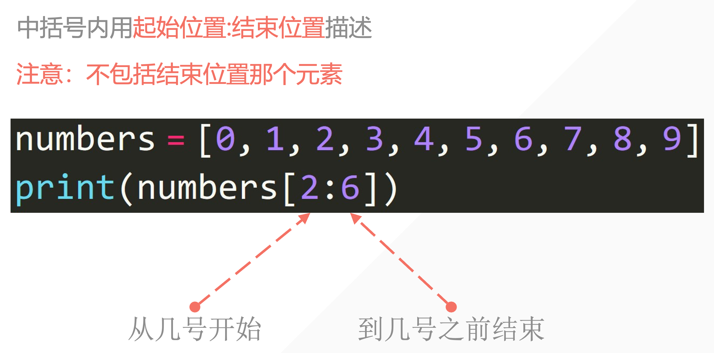

## 1. 列表结构

- 利用 **<span style="color: orange">中括号</span>**
- 列表内的元素用 **<span style="color: orange">逗号</span>** 隔开

- 注意是 **<span style="color: orange">英文输入法</span>** 下的逗号

```python
student1 = ['lilei', 18, 'class01', 201901]
student2 = ['hanmeimei', 19, 'class02', 201902]
```

列表的 **<span style="color: orange">可变性</span>** ：可以修改列表内的内容。

- 字符串强制转换成列表

```python
string_to_list = list('Bornforthis')
print(string_to_list)

# output
['B', 'o', 'r', 'n', 'f', 'o', 'r', 't', 'h', 'i', 's']
```

## 2. 获取列表中的某个元素

### 2.1 列表下标的组成

#### 2.1.1获取列表中的某个元素


中括号内指定元素位置

```python
grade = [98, 99, 95, 80]
print(grade[0])
print(grade[0] + grade[3])

# output
98
178
```

#### 2.1.2 获取列表中连续的几个元素



```python
numbers = [0, 1, 2, 3, 4, 5, 6, 7, 8, 9]
print(numbers[2:6])

# output
[2, 3, 4, 5]
```

#### 2.1.3 **<span style="color: red">获取</span>**列表中连续的几个元素


```python
numbers = [0, 1, 2, 3, 4, 5, 6, 7, 8, 9]
print(numbers[1:7:2])

# output
[1, 3, 5]
```

#### 2.1.4 列表的 **<span style="color: red">切片赋值</span>**

```python
In [1]: name = list('Python')

In [2]: name
Out[2]: ['P', 'y', 't', 'h', 'o', 'n']

In [3]: name[2:] = list('abc')

In [4]: name
Out[4]: ['P', 'y', 'a', 'b', 'c']

In [5]: numbers = [1, 5]

In [6]: numbers[1:1]
Out[6]: []

In [7]: numbers[1:1] = [2, 3, 4]

In [8]: numbers
Out[8]: [1, 2, 3, 4, 5]

In [9]: numbers[1:4]
Out[9]: [2, 3, 4]

In [10]: numbers[1:4] = []

In [11]: numbers
Out[11]: [1, 5]
```

#### 2.1.5 小试牛刀

获取用户输入两个值，一个是要插入的位置，一个是要插入这个位置的值。

- 给定下面列表

```python
numbers = [1, 2, 3, 4, 5, 6]
```

- 例子

```python
Enter position: 3
Enter value: 4
[1, 2, 3, 4, 5, 6]
```

- 代码

```python
numbers = [1, 2, 3, 5, 6]
p = int(input("Enter position:"))
v = int(input("Enter Value:"))
numbers[p:p] = [v]
print(numbers)

# output
Enter position: 3
Enter Value: 4
[1, 2, 3, 4, 5, 6]
```

#### 2.1.6 在列表的特定位置插入元素（.insert(index, element)）

`.insert(index, element)`是一个列表的基本表现方法，用于在列表的指定位置插入一个元素。

他的基本语法是：

```python
list.insert(index, element)
```

- `index`:指定要插入元素的位置。索引从 0 开始。如果指定的索引超出了列表的当前长度「不会报错」，则元素将被添加到列表的末尾。

- `element`:这是你想要插入列表的元素。

```python
numbers = [1, 2, 3, 5, 6]
numbers.insert(3, 4)
print(numbers) # [1, 2, 3, 4, 5, 6]

# output
# [1, 2, 3, 4, 5, 6]
```

#### 2.1.7 获取列表长度（len()）

使用 len（）函数返回列表中元素的个数

```python
# 获取列表长度，使用 len():
student_list = ['李雷', '韩梅梅', '马冬梅']
print(len(student_list))

# output
3
```

#### 2.1.8 修改列表单个元素

通过列表位置编号修改想要修改的元素（list[位置编号]）

```python
# 修改列表元素
name = ['lilei', 'hanmeimei']
name[0] = 'madongmei'
print(name)

# output
['madongmei', 'hanmeimei']
```

#### 2.1.9 修改列表多个元素

类似于前面的切片————list[start:end]，在中括号内起始和结束位置（中括号内左闭右开，因此右边位置得多往边缘方向挪动一位）

```python
# 多个元素修改
numbers = [0, 1, 2, 3, 4, 5, 6, 7, 8, 9, 0]
print('before:', numbers)

numbers[1:5] = ['one', 'two', 'three', 'four']
print('after:', numbers)

# output
before: [0, 1, 2, 3, 4, 5, 6, 7, 8, 9, 0]
after: [0, 'one', 'two', 'three', 'four', 5, 6, 7, 8, 9, 0]
```

字符串也可以被直接分割为元素，加入列表中

```python
# 多个修改的对象也可以是字符串
numbers = [0, 1, 2, 3, 4, 5, 6, 7, 8, 9, 10]
print('before:', numbers)

# 元素数量不一样 & 字符串自动拆开成列表
numbers[1:5] = 'bornforthis'
print('after:', numbers)

# output
before: [0, 1, 2, 3, 4, 5, 6, 7, 8, 9, 10]
after: [0, 'b', 'o', 'r', 'n', 'f', 'o', 'r', 't', 'h', 'i', 's', 5, 6, 7, 8, 9, 10]
```

注意一点的是：即使选择的位置长度小于塞入的元素，最终也会将所有新元素塞入列表


::: info 总结

```
- 列表
- 元组
- 集合
- 字符串
- 字典（放进去的是key）
```

:::

::: warning

**<span style="color: orange">布尔型</span>** 不可以作为列表元素的修改

```python
numbers = [0, 1, 2, 3, 4, 5, 6, 7, 8, 9, 10]
print('before:', numbers)

numbers[1:5] = True
print('after:', numbers)

# output
Traceback (most recent call last):
  File "C:\Users\Administrator\PycharmProjects\Coder\Python\code5.py", line 112, in <module>
    numbers[1:5] = True
TypeError: can only assign an iterable
```

:::

#### 2.1.10 向列表末尾添加单个元素 （.append()）


```python
# 添加单个元素
lst = ['钥匙', '毒药']
print('before:', lst)
lst.append('解药')
print('after:', lst)

# output
after: ['钥匙', '毒药', '解药']
```

#### 2.1.11列表末尾添加多个元素（.extend()）


```python
# 添加多个元素
inventory = ['钥匙', '毒药', '解药']
inventory.extend(['迷药', '感冒药'])
print(inventory)

# output
['钥匙', '毒药', '解药', '迷药', '感冒药']
```


#### 2.1.12 删除列表中的元素1（del）


```python
# 删除列表中的元素
# del
# del 需要指定列表中要删除的单个元素或者多个元素，如果不指定元素，则会删除整个列表

student_list = ['李雷', '韩梅梅', '马冬梅']
del student_list[0]
print(student_list)

# output
['韩梅梅', '马冬梅']


student_list = ['李雷', '韩梅梅', '马冬梅']
del student_list # 不指定元素
print(student_list)

# output
Traceback (most recent call last):
  File "C:\Users\Administrator\PycharmProjects\Coder\Python\code5.py", line 151, in <module>
    print(student_list)
NameError: name 'student_list' is not defined
```


#### 2.1.13列表指定元素位置删除元素2（.pop()）

```
# 删除列表中的元素
# pop()
# pop() 函数默认删除列表中的最后一个元素
# 也可以传参数指定要删除元素下标。
student_list = ['lilei', 'hanmeimei', 'madongmei']
student_list.pop() # 默认删除最后一个
print(student_list)

student_list = ['lilei', 'hanmeimei', 'madongmei']
student_list.pop(0) # 删除 student_list 的 0 号位
print(student_list)

# output
['lilei', 'hanmeimei']
['hanmeimei', 'madongmei']
```

#### 2.1.14 列表指定指定元素值删除元素（.remove()）

```python
# 删除列表中的元素
# remove()
# remove() 指定列表中某个元素
# 例如：remove('aiyc')
# 则指定删除列表中的 'aiyc' 元素
student_list = ['李雷', '韩梅梅', '马冬梅']
student_list.remove('韩梅梅')
print(student_list)

# output
['李雷', '马冬梅']
```

#### 2.1.15 两个列表相加

```python
# 两个列表相加
# 直接使用加相加就可以
numbers1 = [0, 1, 2, 3, 4]
numbers2 = [5, 6, 7, 8, 9]
print(numbers1 + numbers2)

# output
[0, 1, 2, 3, 4, 5, 6, 7, 8, 9]
```

#### 2.1.16 判断元素是否在列表中

```python
# 判断某个元素是否在列表中
inventory = ['a', 'b', 'c']
print('a' in inventory)
print('A' in inventory)

# output
True
False
```


