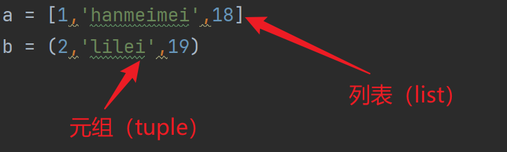

## 1. 创建元组

- 使用小括号创建；
- 里面元素用英文逗号隔开；

```python
tup = ('a', 'b', 'c')
print(tup, type(tup))

# output
('a', 'b', 'c') <class 'tuple'>
```

## 2. 列表和元组的对比



列表和元组的区别：

- 列表中：元素用方括号`[]`包裹；元组中则是`。
- 列表中的元素可以被修改、添加、删除，即列表是可变的数据类型，元组是不可变的数据类型。

## 3. 元组是不可变的

但凡我们想修改元组，都是会报错的：

```python
tup = ('a', 'b', 'c')
tup[0] = 'd'

# output
Traceback (most recent call last):
  File "C:\Users\Administrator\PycharmProjects\Coder\Python\code6.py", line 11, in <module>
    tup[0] = 'd'
TypeError: 'tuple' object does not support item assignment
```

## 4. 元组的取值和分片操作

```python
tup  = (2, 'lilei', 19)
print(tup) # (2, 'lilei', 19)
print(tup[0]) # 2
print(tup[::2]) # (2, 19)
print(tup[::-1]) # (19, 'lilei', 2)

# output
(2, 'lilei', 19)
2
(2, 19)
(19, 'lilei', 2)
```

::: tips Question

基于上面的元组，提取得到：`('lilei', 2)`

```python
tup = (2, 'lilei', 19)
print(tup[-2:-4:-1])

# output
('lilei', 2)
```

:::

## 5. 元组的特点

**思考一下** ：如果元组只有一个元素，是什么类型？

```python
tup = (1)
print(type(tup))

# output
<class 'int'>
```

运行代码后，我们可知：如果元组只有一个元素，那么元素本身的类型。

为什么会是这个结果呢？

- 我们常规在数学计算中括号是在运算的时候用来保证优先级和在适当的情况下，可以直接去掉。
- `(1 + 2) * (2 + 1) * = (3) * (3) = 3 * 3 = 9`, 所以，你可以发现 `(3) * (3) = 3 * 3` 左边的 `(3)` 不就是上面所说的“ 元组只有一个元素的情况”。

如何解决呢？

```python
tup = (1, ) # 如果元组只有一个元素，加个逗号可以以此区分
print(tup)

# output
(1,)
```

## 6. 元组的拼接

```python
tup1 = (1, 2, 3)
tup2 = (4, 5, 6)
new_tup = tup1 + tup2
print(new_tup)

# output
(1, 2, 3, 4, 5, 6)
```

## 7.  元组的排序

- 因为元组不可变，所以先把元组转换成列表；
- 然后再进行排序；
- 接着进行转换回元组；

```python
tup = (9, 7, 5, 3, 1, 2, 4, 6, 8, 0)
lst = list(tup)
tup = tuple(sorted(lst))

print(tup)
```

## 8. zip()

```python
lst1 = [1, 2, 3]
lst2 = ['a', 'b', 'c']
# t = zip(lst1, lst2)
# print(list(t))
zipped = zip(lst1, lst2)
print(zipped) # 是一个 zip 对象、迭代器地址
print(list(zipped)) #  转换成列表来查看，转换成元组也可以但是不方便后续改变
# print(*zipped)

# print(*zipped) # * 号 用来解包
# 当然也可以用循环，但是目前不涉及
# 上面的代码中，你用了列表，后面就用不了 *，因为数据已经被提取走了
```

也可以把元组转为该种形式

```python
tup1 = (1,2,3)
tup2 = ('a','b','c')
zipped = zip(tup1, tup2)
print(zipped) # 是一个迭代器地址
print(list(zipped)) # 转换成列表查看，也可以转换成元组

# output
<zip object at 0x000001EDFCBEBAC0>
[(1, 'a'), (2, 'b'), (3, 'c')]
```

在字典中也有类似的结构

```python
dict1 = {1:'a', 2:'b', 3:'c'}
Item_id = dict1.items()
Item = list(dict1.items())
print(Item_id, Item, sep = '\n')
```
