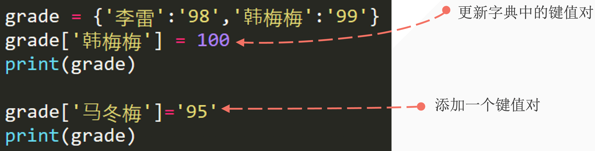
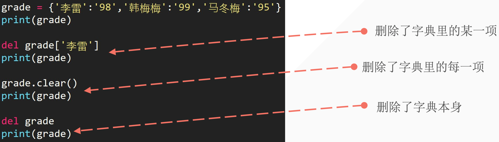

## 1. 如何构建一个电话薄

我们有以下联系人：

| 姓名        | 手机号 |
| ----------- | ------ |
| 李雷        | 123456 |
| 韩梅梅      | 132456 |
| 大卫        | 154389 |
| Mr.Liu      | 131452 |
| Bornforthis | 180595 |
| Alexa       | 131559 |

如何用以往学过的知识构建要给具有用户输入查询功能的电话薄

> 变量、数字型、列表、元组、字符串

程序运行效果：

- 测试一：

```python
Enter your search name: 李雷
The 李雷 phone number is: 123456
```

- 测试二：

```python
Enter your search name: Bornforthis
The 李雷 phone number is: 180595
```

::: code-tabs

@tab code1

```python
names = ['李雷', '韩梅梅', '大卫', 'Mr.Liu', 'Bornforthis', 'Alexa']
numbers = [123456, 132456, 154389, 131452, 180595, 121559]

name = input('Enter your search name: ')
position = names.index(name)
number = numbers[position]

print(f"The {name} phone number is: {number}")
```

@tab code2

```python
# 方法二
names = ['李雷', '韩梅梅', '大卫', 'Mr.Liu', 'Bornforthis', 'Alexa']
numbers = [123456, 132456, 154389, 131452, 180595, 121559]
dictionary = names + numbers

name = input('Enter your search name: ')
position = dictionary.index(name) + int(len(dictionary)/2)
number = dictionary[position]
print(f"The {name} phone number is: {number}")
```

@tab code3

```python
# 方法三
names = ['李雷', '韩梅梅', '大卫', 'Mr.Liu', 'Bornforthis', 'Alexa']
numbers = [123456, 132456, 154389, 131452, 180595, 121559]
dictionary = list(zip(names, numbers))

name = input('Enter your search name: ')
position = names.index(name)
print(position)
number = dictionary[position][1]
print(f"The {name} phone number is: {number}")
```

:::


## 2.  字典结构

- 用花括号表示字典
- 字典内每一项都有两个元素组成：key and value
    - `{key:  value,  key: value}`
- 各项用逗号隔开

```python
dictionary = {'李雷': 1234,'韩梅梅':3456,'马冬梅':7891}
print(dictionary['李雷'])

# output
1234
```

## 3. 字典结构 key & value

- key 和 value 是一一对应，同一个键只能有一个对应的值；
- 键的类型选的是不可变的，如元组；
- value 的类型是任意的；

```python
names = {'name': '李雷', 'number': 1234, True: 'bool', 2:'int'}
print(names)

# output
{'name': '李雷', 'number': 1234, True: 'bool', 2: 'int'}
```

### 4. 用字典 dict 函数创建字典

- 方法一： 根据其他序列创建新建字典

```python
message = [('lilei', 98), ('hanmeimei', 99)]
list_to_dict = dict(message)
print(list_to_dict)

# output
{'lilei': 98, 'hanmeimei': 99}


message = [['lilei', 98], ['hanmeimei', 99]]
list_to_dict = dict(message)
print(list_to_dict)

# output
{'lilei': 98, 'hanmeimei': 99}
```

- 方法二：

```python
d = dict(lilei=98, hanmeimei=99)
print(d)

# output
{'lilei': 98, 'hanmeimei': 99}
```

::: info 上面两种创建字典的方法，有什么优缺点？

上面方法一的方法，可以更好的适配字典的各种数据类型情况。why？——因为结构是列表里面放元组，而元组的 0 号为放 key， 1号位放 value 。所以，只要是不可变的数据类型都可以放在 0 号位。

反之方法二：第一个位置必须是’变量‘，不能是其他数据类型。如：

```python
d1 = dict(lilei=98, hanmeimei=99)
d2 = dict('lilei'=98, 'hanmeimei'=99)
```

上面的第二行代码，看起来就很奇怪了，一共有两个值一个值是 `lilei` 另一个值 98 两个都是值， 可以用 `98 `赋值给另一个值吗？————显然是不行的。

我们的赋值是需要把一个值赋值给一个变量（有空间）。

所以，第二种方法虽然可以创建字典，但是对于字典 key 的各种情况并不能完全支持。

> Output 时第二种的 key 只能得到字符串

:::

## 5. 访问字典数据

### 5.1 中括号访问

- 利用中括号加要查询的 key

```python
grade = {'lilei':'98', 'hanmeimei':'99'}
print(grade['lilei'])

# output
98
```

### 5.2 访问字典键

- 如果访问字典时输入不存在的 key 会怎么样：

```python
dict1 = {1:'a', 2:'b', 3:'c'}
print(dict1[4])

# output
Traceback (most recent call last):
  File "C:\Users\Administrator\PycharmProjects\Coder\Python\code7.py", line 2, in <module>
    print(dict1[4])
KeyError: 4
```

显然，如果直接访问访问键不存在时，会报错，但是我们在实际情况中有时不希望找不到键就报错，那应该怎么办？

- `get()`

当使用 get 方法时，需要提供一个键（key），方法会返回与该键关联的值。如果该键在字典中不存在，get 方法将返回 None，或者你可以指定一个默认值，如果键不存在，则返回这个默认值。

这是 get 方法的基本语法：

`value = dictionary.get(key, default_value)`

- key：你想要检索的键。
- default_value：（可选）如果键不存在时返回的值。如果未提供此参数，默认值为 None。

代码示例：

```python
# 创建一个简单的字典
my_dict = {'name': 'Alice', 'age': 25}

# 使用 get 访问一个存在的键
print(my_dict.get('name'))  # 输出: Alice

# 使用 get 访问一个不存在的键，并提供默认值。
# 如果没有提供第二个参数，则返回 None
print(my_dict.get('gender', 'Not Specified'))  # 输出: Not Specified

# output
Alice
Not Specified
```

在第一个 get 调用中，我们访问了键 'name'，它在字典中存在，因此返回了对应的值 'Alice'。在第二个调用中，我们试图访问键 'gender'，它在字典中不存在，因此返回了我们指定的默认值 'Not Specified'。

#### 5.2.1 如何区分两者的使用场景呢？

- python 底层逻辑是基于 c/c ++ 语言实现的，直接使用 `[]` 只有一次转换，比使用 `get.()` 经过多次转换的执行时间更短

- 在如电话薄查询时，不希望查找失败就报错

### 5.3  字典的操作

#### 5.3.1 修改

字典修改或添加数据原则：有则改之，无则加勉「无则添加」



 代码示例：

```python
grade = {'李雷':'98', '韩梅梅':'99'}
print(grade)

grade['韩梅梅'] = 100 # key in grade
print(grade)

grade['马冬梅'] = '95' # key not in grade
print(grade)

# output
{'李雷': '98', '韩梅梅': '99'}
{'李雷': '98', '韩梅梅': 100}
{'李雷': '98', '韩梅梅': 100, '马冬梅': '95'}
```

#### 5.3.2 删除



```python
# 1.
grade = {'李雷': '98', '韩梅梅': 100, '马冬梅': '95'}
del grade['李雷'] 
print(grade)

# output
{'韩梅梅': 100, '马冬梅': '95'}


# 2.
grade = {'李雷': '98', '韩梅梅': 100, '马冬梅': '95'}
del grade #
print(grade)

# output
Traceback (most recent call last):
  File "C:\Users\Administrator\PycharmProjects\Coder\Python\code7.py", line 48, in <module>
    print(grade)
NameError: name 'grade' is not defined


# 3.
grade = {'李雷': '98', '韩梅梅': 100, '马冬梅': '95'}
grade.clear()
print(grade)
# output
{}
```

#### 5.3.3 获取列表的键和值

- keys()
- values()
- items()

```python
student = {'name': 'lilei', '成绩':'98', '实验班':'98', '实验班':'True'}
print(student)

# 获取所有的 key：
print(student.keys())
print(list(student.keys()))
# 获取所有的 value：
print(student.values())
print(list(student.values()))
# 同时获取 key 和 value：
print(student.items())
print(list(student.items()))

# output
{'name': 'lilei', '成绩': '98', '实验班': 'True'}
dict_keys(['name', '成绩', '实验班'])
['name', '成绩', '实验班']
dict_values(['lilei', '98', 'True'])
['lilei', '98', 'True']
dict_items([('name', 'lilei'), ('成绩', '98'), ('实验班', 'True')])
[('name', 'lilei'), ('成绩', '98'), ('实验班', 'True')]
```

#### 5.3.4 判断字典中的元素

- 默认情况

```python
# 默认情况是判断 key 在字典中
dict1 = {'name':'lilei', 'age':19}
print('name' in dict1)
print('class' in dict1)

# output
True
False
```

- 使用 keys 实现纯粹判断

```python
# 也可以在后面加上 .values() 判断是否为字典中的值
dict1 = {'name':'lilei', 'age':19}
print(19 in dict1.values()) # True
```

- 使用 values 实现纯粹判断

```python
dict1 = {'name':'lilei', 'age':19}
print('name' in dict1.keys()) # True
```

### 5.4 字典的嵌套

嵌套： 将一系列的字典存储在列表中，或将列表作为储存在字典中。

- 字典列表
- 在字典中存储列表
- 在字典中存储字典

1. 字典构成列表

```
# 字典构成列表
student1 = {'name':'lilei', 'age':'18', 'grade':'98'}
student2 = {'name':'hanmeimei', 'age':'19', 'grade':'99'}
student3 = {'name':'lilei', 'age':'18', 'grade':'95'}

student = [student1, student2, student3]
print(student)

# output
{'name': 'lilei', 'age': '18', 'grade': '98'}, {'name': 'hanmeimei', 'age': '19', 'grade': '99'}, {'name': 'lilei', 'age': '18', 'grade': '95'}]
```

2. 在字典中存储列表

```python
favorite_class = {
    'lilei':['数学','英语'],
    'hanmeimei':['语文'],
    'madongmei':['计算机','物理','数学'],

}

print(favorite_class['lilei'])
print(favorite_class['lilei'][0])

# output
['数学', '英语']
数学
```

3.  在字典中存储字典

```python
# 用一个字典表示学生信息
student1 = {'name':'lilei', '成绩':'98', '实验班':True}


# 用一个字典表示全班学生信息
class1 = {
    'lilei':{'成绩':'98','实验班':True},
    'hanmeimei':{'成绩':'95','实验班':False}
}

print(class1['lilei'])
print(class1['lilei']['成绩'])
print(class1['hanmeimei']['实验班'])

# output
{'成绩': '98', '实验班': True}
98
False
```

