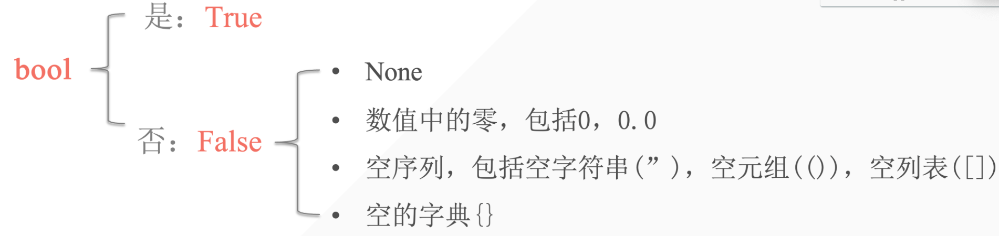

## 1. 布尔值

意义：表示判断中的是与否。一般用于条件测试中。

```python
In [1]: a = True

In [2]: a
Out[2]: True

In [3]: 10 < 5
Out[3]: False

In [4]: 10 > 8
Out[4]: True
```




- 所有的非空就是 True
- 所有的空序列，空数字皆为 False


## 2. 逻辑运算符

逻辑运算符：用于检测两个或两个以上的条件是否满足

逻辑运算只存在于布尔类型中。

| 逻辑运算符      | 描述                                                         |
| --------------- | ------------------------------------------------------------ |
| and（逻辑‘与’） | 当运算符两边的两个运算对象都为 True 时，结果才为 True        |
| or（逻辑‘或’）  | 当运算符两边大的两个运算对象其中有一个为 True，结果即为 True |
| not（逻辑‘非’） | 反转运算符对象的状态                                         |

| exp         | bool           | value | return value |
| ----------- | -------------- | ----- | ------------ |
| 3 and 5     | True and True  | True  | 5            |
| 3 or 5      | True or True   | True  | 3            |
| 0 or 5      | False or True  | True  | 5            |
| 3 and not 5 | True and False | False |              |

```python
print(3 and 5)
print(3 or 5)
print(0 or 5)
print(3 and not 5) # 不会返回 not 5

# output
5
3
5
False
```


```python
In [5]: True and False or True
Out[5]: True

In [6]: False or False or not False
Out[6]: True
```

## 3. 表达式应用————条件测试

- 检查当前变量是否与一个特定值相等/不相等
- 比较数字大小
- 检查特定值是否在序列里
- 使用 and 检查多个文件

```python
```

- 使用 or 检查多个文件
