## 1. 进入网址

https://github.com/zbezj/HEU_KMS_Activator

点击上方网址，进入网址内部。

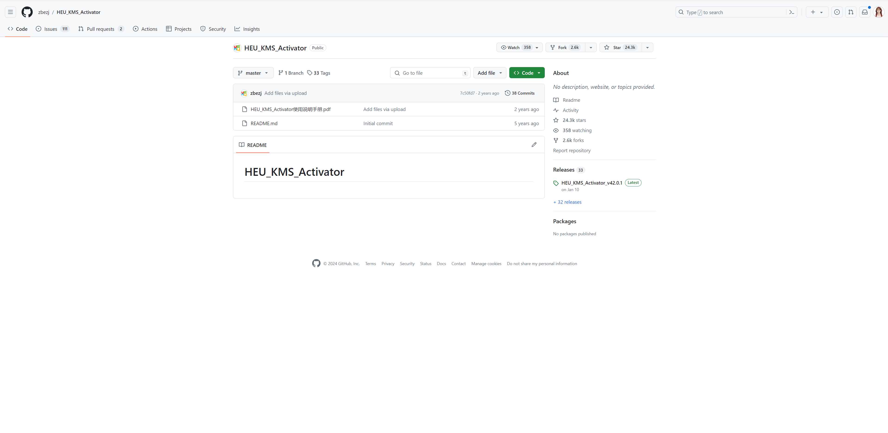

---

## 2.安装激活插件的压缩包

### 2.1 点击图中所示的位置

1. **操作一**

    点击图中位置。

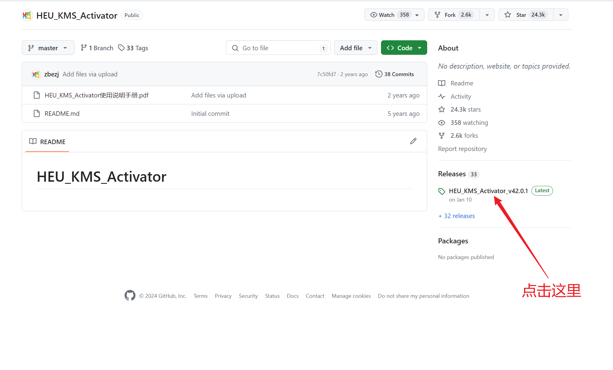

---

2. **操作二**

    点击图中所示位置，下载文件。

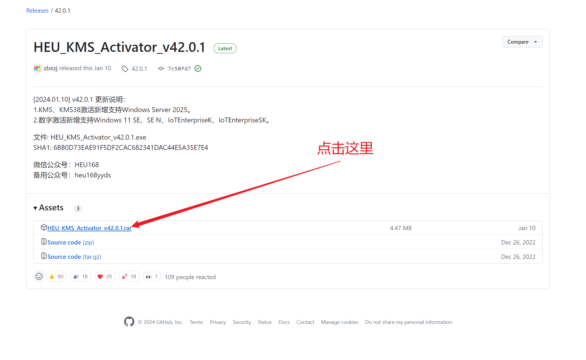

### 2.3 出现图中所示提示的解决办法

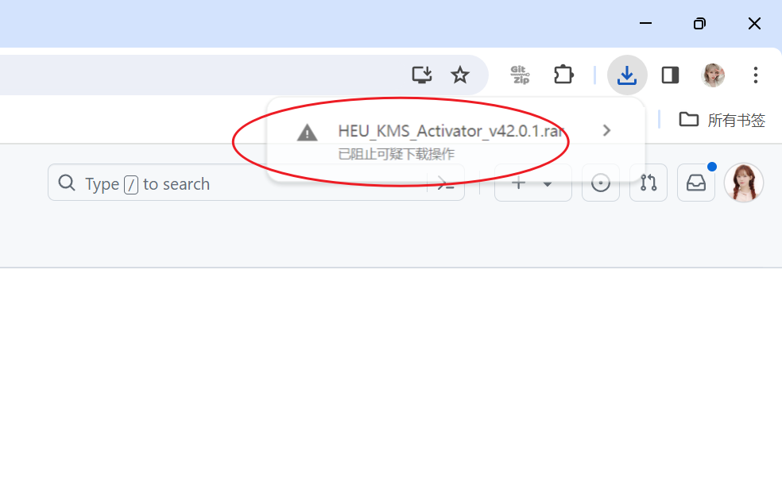

如果出现上图的问题，则请进行以下操作：

1. 点击右上角的三个小点

2. 点击后会出现列表，选择‘下载内容’选项

    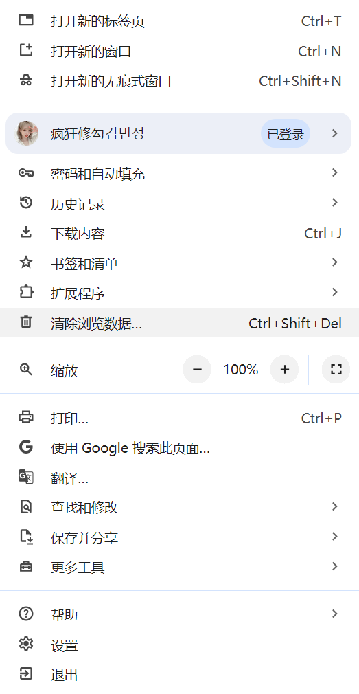

3. 进入下载内容后，选择“保留内容”，再选择”仍然保留“

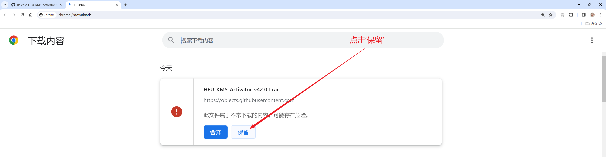

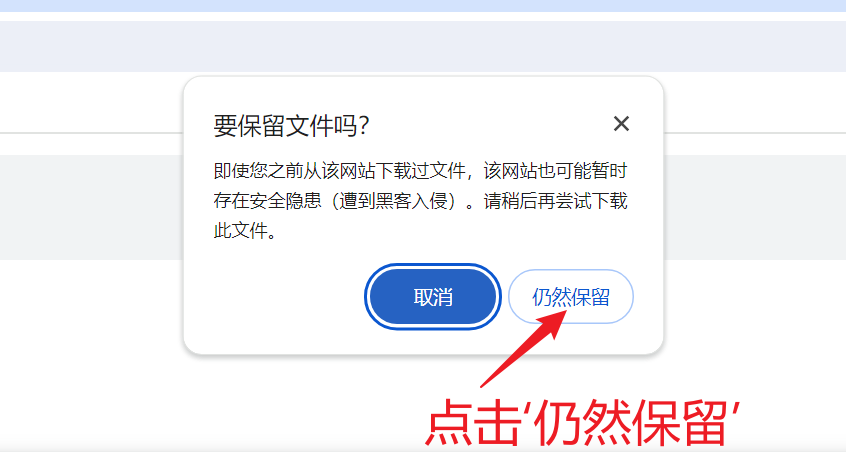

- 注意：如果出现”失败 - 检测到病毒“，则进行以下操作，没有则直接跳过

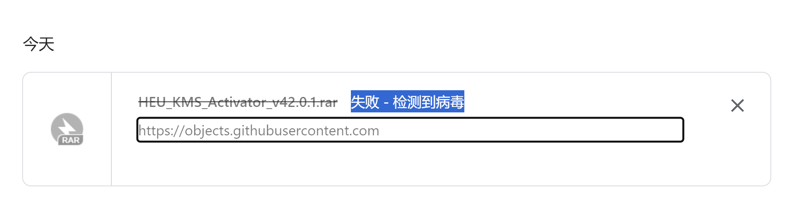

- ​	如何关闭病毒检测：

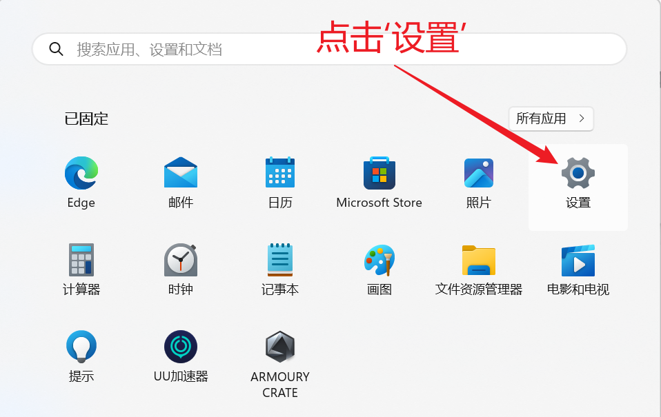

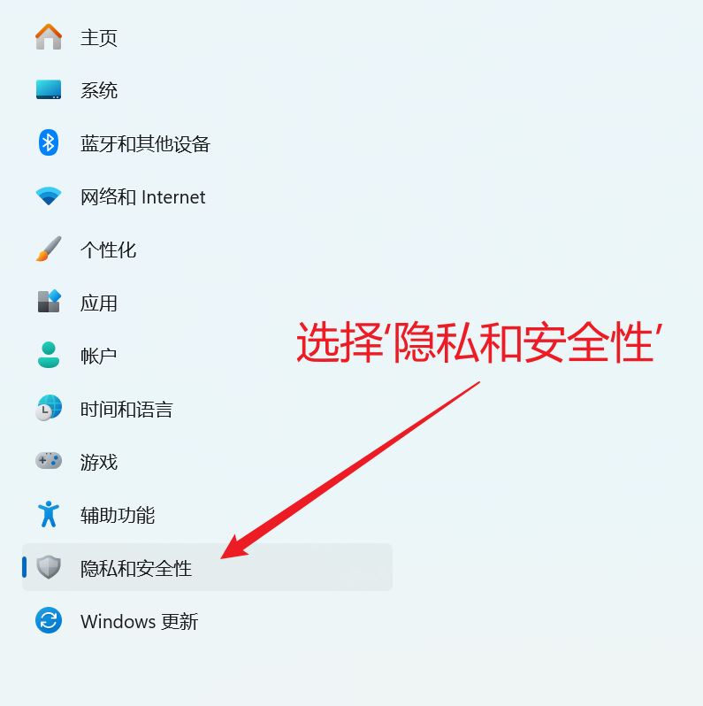

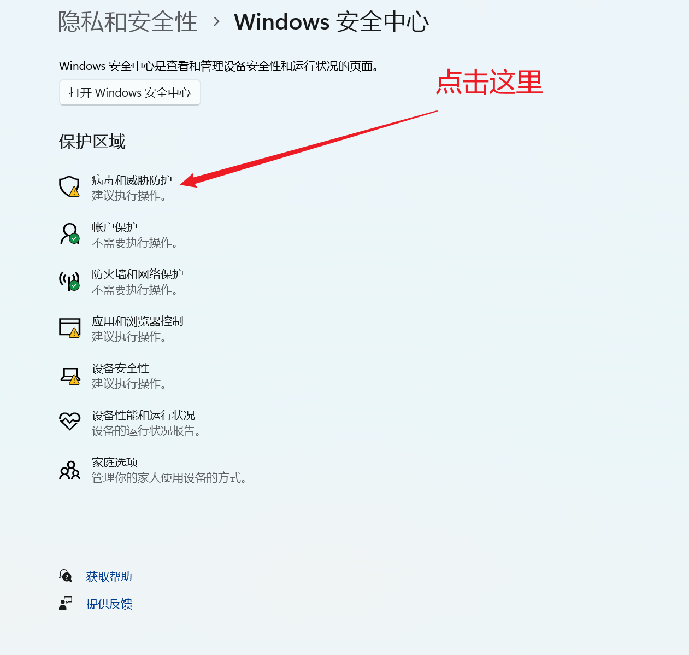

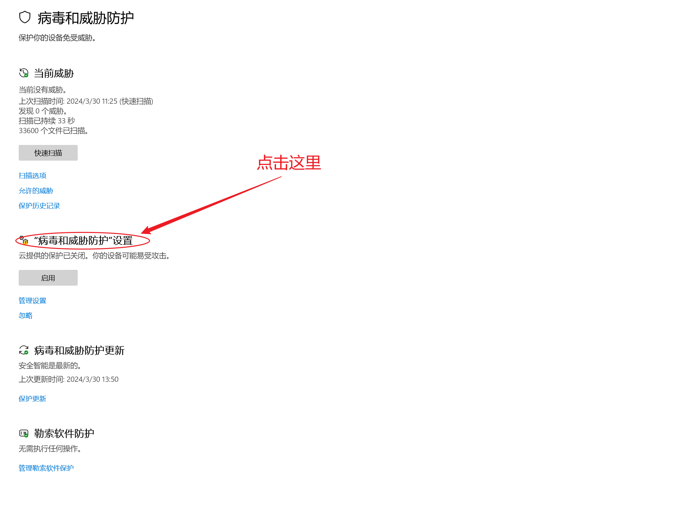

图中三项安全保护确保为关闭状态

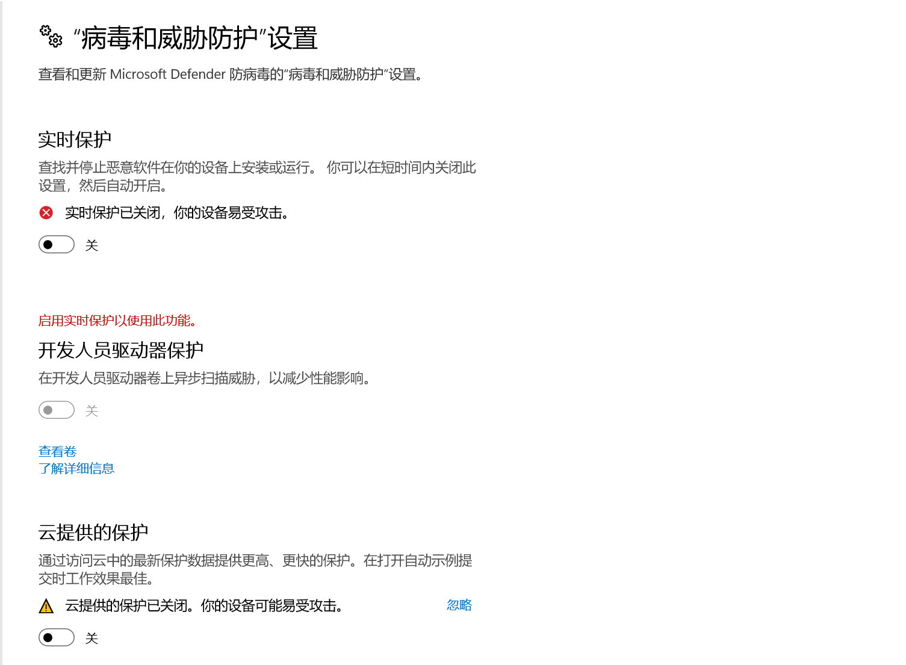

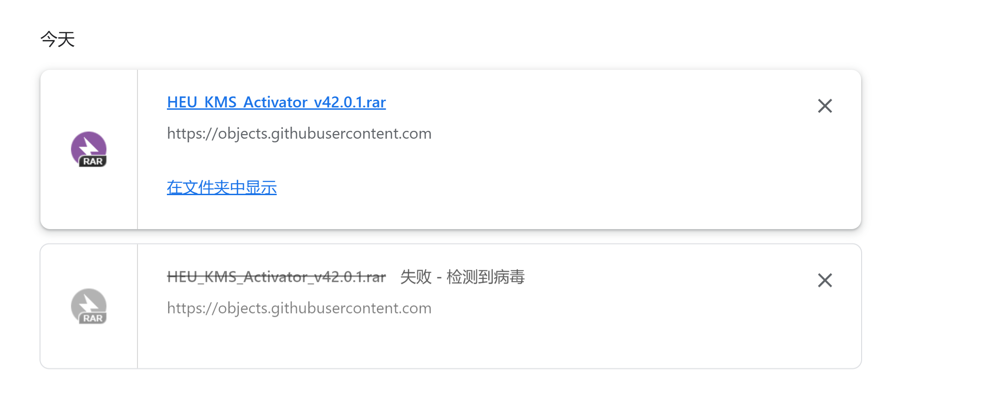

再次安装文件，如果为上面所示状态则表明安装成功

## 3. 解压安装包

1. 打开文件后，选择自己电脑中安装的解压软件解压文件，并选择合适的安装位置，在此不多赘述。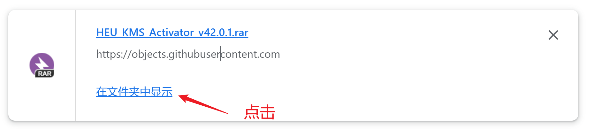

2. 解压文件后，在文件所在位置点击文件，选择确定，开始运行激活软件

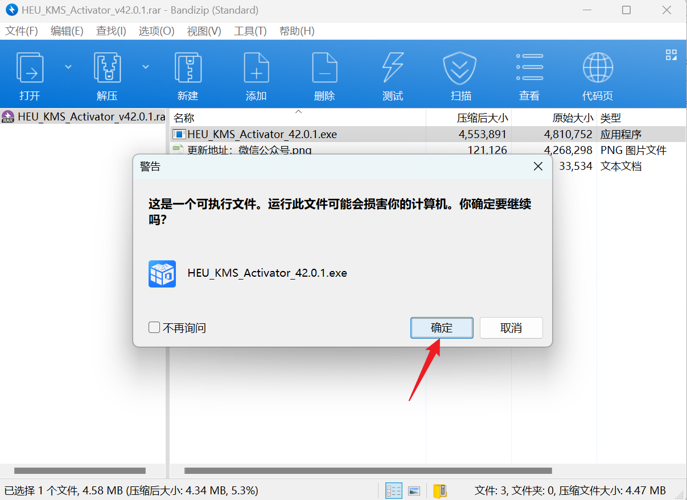

  

## 4. 使用激活软件

1. 确保自己已经安装Microsoft office软件，点击运行软件，选择开始

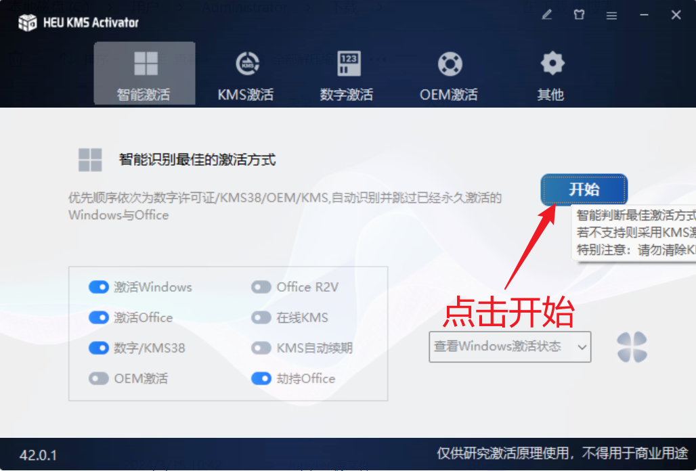

2. 若出现下图所示提示，则说明已经激活成功，可以使用office办公软件了。

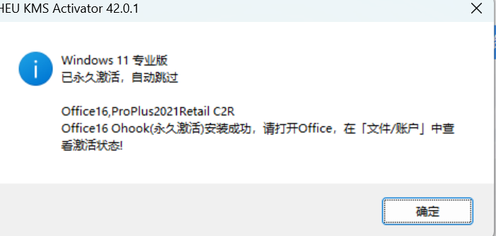
