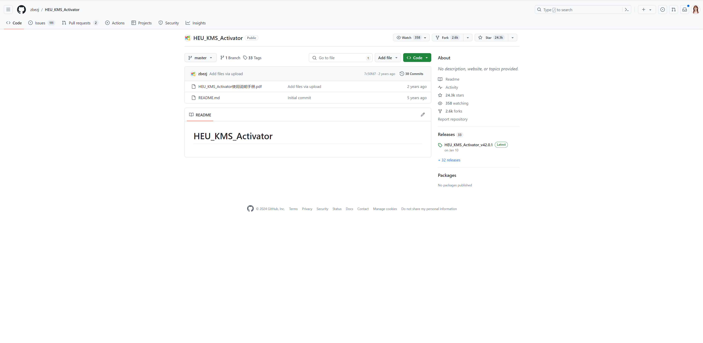
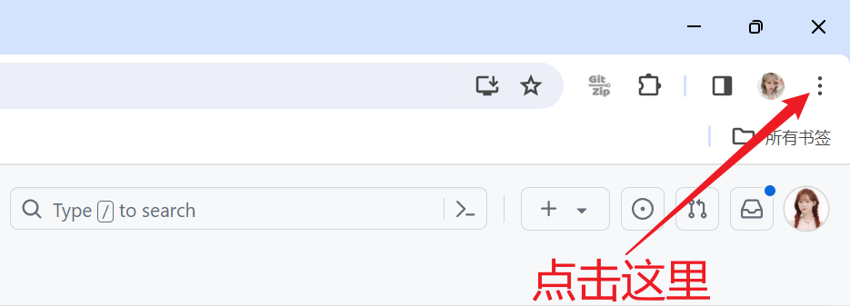
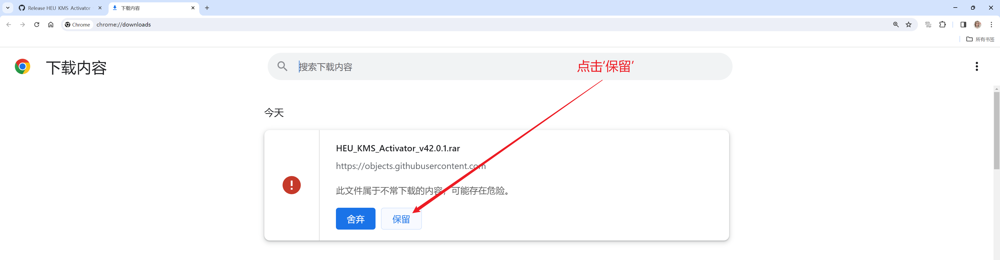

## 1. 进入网址

https://github.com/zbezj/HEU_KMS_Activator

点击上方网址，进入网址内部。

---

## 2.安装激活插件的压缩包

### 2.1 点击图中所示的位置

1. **操作一**

    点击图中位置。

---

2. **操作二**

    点击图中所示位置，下载文件。

### 2.3 出现图中所示提示的解决办法

如果出现上图的问题，则请进行以下操作：

1. 点击右上角的三个小点

2. 点击后会出现列表，选择‘下载内容’选项

    

3. 进入下载内容后，选择“保留内容”，再选择”仍然保留“

注意：如果出现”失败 - 检测到病毒“，则进行以下操作，没有则直接跳过

